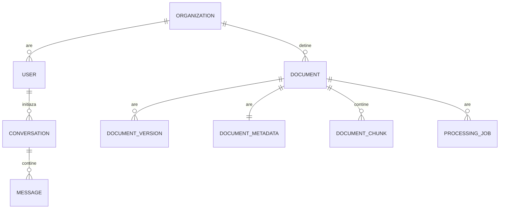
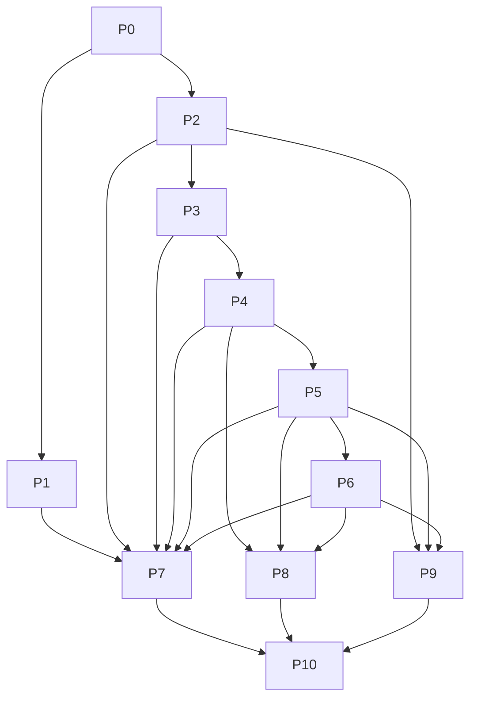
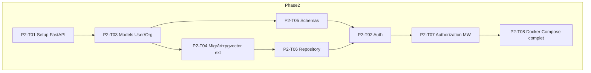
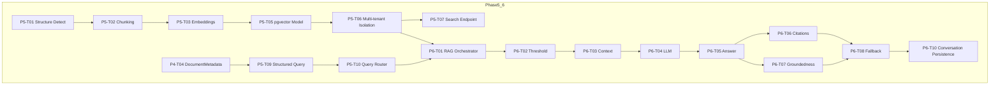

# Document Intelligence Platform — Implementation Backlog

*Sursă de adevăr: `document-intelligence-platform-blueprint.md`. Acest document transformă blueprintul în backlog tehnic implementabil, task cu task, compatibil cu Claude Code.*

---

# 1. Înțelegerea Proiectului

Document Intelligence Platform este un sistem de Contract & Compliance Intelligence pentru echipe de procurement/legal ops, care transformă contracte nestructurate (PDF, DOCX, scanări) într-o bază de cunoștințe interogabilă, cu extracție structurată validată și RAG cu citare obligatorie. MVP-ul demonstrează un flux end-to-end complet: upload → procesare → extracție → indexare → căutare → întrebare → răspuns ancorat cu citații. Stack-ul confirmat de blueprint: Python + FastAPI, PostgreSQL + pgvector, React + TypeScript, sentence-transformers (model multilingual), Ollama/LLM local sau API extern opțional, Docker Compose. Acest backlog nu modifică nicio decizie de arhitectură — le transformă în taskuri implementabile.

---

# 2. Principii Arhitecturale Extrase din Blueprint (păstrate strict)

1. **Determinist unde se poate, probabilistic doar unde e necesar** — parsing/storage/validare sunt cod determinist; clasificarea e ML clasic; extracția complexă și generarea răspunsului sunt LLM, cu validare.
2. **Separare ingestion (asincron, o dată) de query (sincron, rapid)** — procesarea grea a documentului nu se repetă la fiecare întrebare.
3. **Query Routing obligatoriu** — întrebările de agregare/filtrare temporală merg către SQL structurat pe `DocumentMetadata`, nu către vector search; întrebările semantice merg către RAG; hibrizii combină ambele.
4. **Citare obligatorie pe orice răspuns AI** — fără citație verificabilă, sistemul răspunde explicit „nu am găsit suficiente informații”.
5. **Chunking structure-aware** (pe articole/clauze), nu tăiere mecanică pe număr fix de tokens.
6. **Multi-tenant isolation** pe pgvector via over-fetch + filtrare aplicativă (MVP), cu RLS ca strat suplimentar; table partitioning e V1/scală mare.
7. **OCR condiționat**, nu implicit — activat doar dacă parsing-ul nativ eșuează.
8. **Reranking opțional** — introdus DOAR dacă evaluarea arată recall/precision insuficiente din retrieval simplu.
9. **Model de embedding multilingual** (`bge-m3` sau echivalent) — corpus real e în română/bilingv.
10. **Monolit, nu microservicii/Kubernetes/Kafka** — complexitate justificată doar de o problemă reală, măsurată.
11. **Cost zero/minim în dezvoltare** — tot rulează local via Docker Compose; LLM extern plătit e opțional, nu obligatoriu.
12. **Evaluare cantitativă obligatorie** — nicio afirmație de calitate fără metrică pe set de test adnotat.

---

# 3. Assumptions & Decisions (unde blueprintul e ambiguu)

> ⚠️ DECIZIE DE VALIDAT — **1. Motorul OCR concret**
> Ce spune blueprintul: „Tesseract (sau echivalent)”. Problema: nu e fixată o alegere fermă. Alternativă propusă: Tesseract via `pytesseract`, ca implementare de referință MVP. De ce: gratuit, local, suficient pentru documente scanate standard. Obligatoriu/opțional: opțional de schimbat ulterior (ex: modele DL moderne de OCR) dacă evaluarea arată acuratețe insuficientă.

> ⚠️ DECIZIE DE VALIDAT — **2. LLM concret pentru RAG în MVP**
> Blueprintul lasă opțiunea „local (Ollama) sau API extern”. Decizie asumată pentru backlog: dezvoltare și evaluare inițială cu un model local via Ollama (ex: Llama 3.1 8B sau Mistral 7B — alegere fină la implementare, nu în backlog), API extern rămâne task explicit V1/opțional. Motiv: respectă principiul de cost zero din blueprint.

> ⚠️ DECIZIE DE VALIDAT — **3. Autentificare în MVP**
> Blueprintul menționează JWT dar nu clarifică dacă înregistrarea multi-organizație e MVP sau V1. Decizie asumată: autentificare + o singură organizație per instanță de test e suficientă pentru MVP; onboarding multi-organizație self-service e V1.

> ⚠️ DECIZIE DE VALIDAT — **4. Coadă de task-uri (queue)**
> Blueprintul menționează generic „worker asincron”, fără a fixa tehnologia (Celery vs RQ vs FastAPI BackgroundTasks). Decizie asumată: FastAPI `BackgroundTasks` + un tabel `ProcessingJob` ca sursă de adevăr a stării, suficient pentru MVP single-instanță; Celery/RQ devine task V1 dacă volumul de procesare concurentă o cere (consistent cu principiul „complexitate justificată de o problemă reală”).

> ⚠️ DECIZIE DE VALIDAT — **5. Reranking**
> Confirmat Future/Optional conform blueprint — task creat dar marcat P3, condiționat de rezultatele Evaluation (Phase 8).

> ⚠️ DECIZIE DE VALIDAT — **6. Table partitioning pentru pgvector**
> Blueprintul specifică asta ca soluție „la scală”. Decizie asumată: NU e parte din MVP/V1 backlog — documentat ca Future, condiționat de profilare reală la volum mare, consistent cu regula de simplitate.


---

# 4. Requirement Traceability Matrix

| Blueprint Requirement | Phase | Task(s) | MVP/V1/Future |
|---|---|---|---|
| Product/schema foundation, ADR | P0 | P0-T01…P0-T04 | MVP |
| Design system & tokens | P1 | P1-T01…P1-T04 | MVP |
| Backend skeleton, auth, DB, Docker | P2 | P2-T01…P2-T08 | MVP |
| Upload + storage + ProcessingJob | P3 | P3-T01…P3-T04 | MVP |
| PDF parsing / OCR fallback / cleaning | P3 | P3-T05…P3-T08 | MVP |
| Document classification (TF-IDF+LogReg) | P4 | P4-T01…P4-T04 | MVP |
| Information extraction (reguli+LLM+confidence) | P4 | P4-T05…P4-T09 | MVP |
| Corectare manuală extracție | P4 | P4-T10 | MVP |
| Structure-aware chunking | P5 | P5-T01…P5-T02 | MVP |
| Embeddings (model multilingual) + pgvector storage | P5 | P5-T03…P5-T05 | MVP |
| Multi-tenant isolation pe vector search | P5 | P5-T06 | MVP |
| Semantic Search (nu RAG) + metadata filtering | P5 | P5-T07…P5-T09 | MVP |
| Query Routing (SQL vs semantic vs hibrid) | P5 | P5-T10 | MVP |
| Retrieval + Context Construction | P6 | P6-T01…P6-T03 | MVP |
| LLM integration + prompt construction | P6 | P6-T04…P6-T05 | MVP |
| Citation generation + Groundedness validation | P6 | P6-T06…P6-T07 | MVP |
| „Nu am găsit informații” behavior | P6 | P6-T08 | MVP |
| Reranking | P6 | P6-T09 | Future/Optional |
| Conversation/Message persistence | P6 | P6-T10 | MVP |
| Dashboard, Library, Upload UI | P7 | P7-T01…P7-T04 | MVP |
| Document Viewer + Extraction UI | P7 | P7-T05…P7-T07 | MVP |
| Search UI + Search Results | P7 | P7-T08…P7-T09 | MVP |
| AI Assistant UI + Citations UI | P7 | P7-T10…P7-T12 | MVP |
| Settings, Collections | P7 | P7-T13…P7-T14 | V1 |
| Evaluation datasets + metrici | P8 | P8-T01…P8-T06 | MVP (dataset+classification+retrieval), V1 (RAG completă) |
| Multi-tenant defense, prompt injection, secrets | P9 | P9-T01…P9-T06 | MVP |
| Observability, README, demo | P10 | P10-T01…P10-T06 | MVP |
| Onboarding multi-organizație self-service | — | Future | Future |
| Table partitioning pgvector | — | Future | Future |
| API LLM extern producție | P6-T04 (extensie) | Future | V1/Future |

---

# 5. Phase Overview

| Phase | Scop | Dependencies | MVP/V1/Future |
|---|---|---|---|
| P0 — Product Foundation | Fixarea schemei conceptuale, ADR-uri, structura repo | Blueprint (deja existent) | MVP |
| P1 — UX/UI Foundation | Design system, tokens, skeleton de navigare | P0 | MVP |
| P2 — Backend Foundation | FastAPI, DB, migrări, auth, Docker | P0 | MVP |
| P3 — Document Ingestion & Processing | Upload, storage, parsing, OCR, cleaning | P2 | MVP |
| P4 — Document Intelligence | Clasificare + extracție + confidence | P3 | MVP |
| P5 — Search (Embeddings + Semantic Search + Query Routing) | Chunking, embeddings, pgvector, căutare, rutare | P4 | MVP |
| P6 — RAG | Retrieval + LLM + citații + groundedness | P5 | MVP |
| P7 — Frontend Integration | Toate ecranele conectate la API real | P1, P2, P6 (progresiv) | MVP |
| P8 — Evaluation | Seturi de test, metrici, raport | P4, P5, P6 | MVP (parțial) / V1 (complet) |
| P9 — Security | Izolare, prompt injection, secrete | P2…P6 (transversal) | MVP |
| P10 — Production Polish | Observability, README, demo | Toate | MVP |


---

# 6. Detailed Implementation Backlog

## Phase 0 — Product Foundation

### Objective
Fixarea artefactelor de decizie (schema conceptuală, ADR-uri, structura de repo) înainte de orice cod, conform blueprint Secțiunea 0/34.

### Dependencies
Niciuna (blueprintul e sursa de intrare).

### Deliverables
Document de schema DB finală (secțiunea 7 din acest backlog), ADR log inițial, structură de repo (`backend/`, `frontend/`, `docs/`), fișier `.env.example`.

### Phase Acceptance Criteria
- [ ] Schema DB finală e documentată (entități + relații + indexuri).
- [ ] Structura de repo există și e goală dar organizată.
- [ ] ADR log conține deciziile din blueprint + assumption-urile din Secțiunea 3.

### Ce NU implementăm încă
Niciun cod funcțional — doar structură și documentație.

### Parallel Work
P0-T01, P0-T02, P0-T03 pot rula în paralel (documente independente).

### Blocking Tasks
P0-T04 (repo skeleton) blochează începerea P1/P2.

---

#### P0-T01 — Finalizarea Schemei Conceptuale a Bazei de Date
- **Obiectiv:** Documentul final de schema (vezi Secțiunea 7 a acestui backlog) e revizuit și confirmat ca sursă de adevăr pentru P2/P4/P5.
- **Motiv:** Fără schema fixată, taskurile de backend/AI ar re-decide structura ad-hoc.
- **Scope:** Entități, câmpuri, relații, indexuri, constrângeri.
- **Out of Scope:** Migrări SQL efective (P2-T04).
- **Priority:** P0
- **Product Scope:** MVP
- **Dependencies:** None
- **Blocks:** P2-T03, P2-T04, P4-T04, P5-T05
- **Parallelizable:** YES
- **Implementation Requirements:** Confirmă entitățile din Secțiunea 7 (Organization, User, Document, DocumentVersion, DocumentMetadata, DocumentChunk, ProcessingJob, Conversation, Message; Collection ca V1).
- **Expected Architecture Impact:** Database
- **Expected Files/Modules:** `docs/database-schema.md`
- **API Impact:** None
- **Acceptance Criteria:**
  - [ ] Toate entitățile MVP au câmpuri și relații documentate.
  - [ ] Entitățile excluse din MVP (Collection) sunt marcate explicit V1.
- **Definition of Done:** Documentul e revizuit, nu conține entități nejustificate.
- **Tests:** N/A (document).

#### P0-T02 — Architectural Decision Log Inițial
- **Obiectiv:** Consolidarea deciziilor din blueprint + assumption-urile din Secțiunea 3 într-un ADR log versionat.
- **Motiv:** Previne redeciderea silențioasă a arhitecturii pe parcursul implementării.
- **Scope:** Toate deciziile marcate ⚠️ + deciziile majore de stack.
- **Out of Scope:** Decizii de implementare fină (ex: numele exact al unei clase).
- **Priority:** P0
- **Product Scope:** MVP
- **Dependencies:** None
- **Blocks:** Nimic direct, dar referențiat de toate fazele.
- **Parallelizable:** YES
- **Implementation Requirements:** `docs/adr/` cu un fișier per decizie majoră (format: Context/Decizie/Alternative/Consecințe).
- **Expected Architecture Impact:** Documentation
- **Expected Files/Modules:** `docs/adr/0001-*.md` ... `docs/adr/000N-*.md`
- **API Impact:** None
- **Acceptance Criteria:**
  - [ ] Există un ADR pentru fiecare decizie ⚠️ din Secțiunea 3.
  - [ ] Fiecare ADR are alternative și motiv explicit.
- **Definition of Done:** ADR log revizuit, fără decizii contradictorii.
- **Tests:** N/A.

#### P0-T03 — Structura de Repo (Backend + Frontend + Docs)
- **Obiectiv:** Skeleton de foldere pentru backend/frontend/docs, fără cod funcțional.
- **Motiv:** Bază comună pentru toate taskurile ulterioare.
- **Scope:** Foldere goale + README stub + `.gitignore` + `.env.example`.
- **Out of Scope:** Orice implementare de logică.
- **Priority:** P0
- **Product Scope:** MVP
- **Dependencies:** None
- **Blocks:** P1-T01, P2-T01
- **Parallelizable:** YES
- **Implementation Requirements:** Structura conform Secțiunilor 8/12 din blueprint (`app/api`, `app/services`, `app/repositories`, `app/models`, `app/schemas`, `app/ai`, `app/processing`, `app/workers`, `app/core`; frontend: `src/pages`, `src/components`, `src/features`, `src/api`, `src/state`).
- **Expected Architecture Impact:** Backend, Frontend, Infrastructure
- **Expected Files/Modules:** vezi structura de mai sus (goale).
- **API Impact:** None
- **Acceptance Criteria:**
  - [ ] Repo clonabil, structura de foldere există exact conform planului.
  - [ ] `.env.example` listează toate variabilele necesare anticipate (DB_URL, JWT_SECRET, LLM config, EMBEDDING_MODEL).
- **Definition of Done:** Structura revizuită față de blueprint, fără foldere nejustificate.
- **Tests:** N/A.

#### P0-T04 — Docker Compose Skeleton (fără servicii funcționale)
- **Obiectiv:** Fișier `docker-compose.yml` inițial cu serviciile PostgreSQL (+ pgvector), backend, frontend — fără logică implementată încă.
- **Motiv:** Mediu de dezvoltare reproductibil de la început (blueprint Secțiunea 29-30).
- **Scope:** Definire servicii, porturi, volume, variabile de mediu.
- **Out of Scope:** Orice cod de aplicație.
- **Priority:** P0
- **Product Scope:** MVP
- **Dependencies:** P0-T03
- **Blocks:** P2-T01
- **Parallelizable:** NO (depinde de structura de repo)
- **Implementation Requirements:** Servicii: `db` (postgres + pgvector image), `backend` (placeholder), `frontend` (placeholder). Volume persistent pentru DB.
- **Expected Architecture Impact:** Infrastructure
- **Expected Files/Modules:** `docker-compose.yml`
- **API Impact:** None
- **Acceptance Criteria:**
  - [ ] `docker compose up` pornește serviciul `db` cu extensia `vector` disponibilă.
- **Definition of Done:** Mediu pornește curat, fără erori.
- **Tests:** Test manual de pornire.

---

## Phase 1 — UX/UI Foundation

### Objective
Design system (tokens, componente de bază) și skeleton de navigare, conform blueprint Secțiunile 19-21.

### Dependencies
P0-T03.

### Deliverables
Bibliotecă de componente de bază (Button, Input, Table, Badge, Modal, Tooltip), tokens de design (culori, spacing, typography), routing skeleton (pagini goale navigabile).

### Phase Acceptance Criteria
- [ ] Toate componentele de bază există și respectă tokens.
- [ ] Navigarea între pagini (goale) funcționează.

### Ce NU implementăm încă
Nicio pagină conectată la date reale (API). Toate paginile sunt shell-uri statice.

### Parallel Work
P1-T01…P1-T04 pot rula complet în paralel cu P2 (backend), pentru că nu depind de API.

### Blocking Tasks
P1-T04 (routing skeleton) blochează integrarea reală din P7.

---

#### P1-T01 — Design Tokens (culori, typography, spacing, radius, shadows)
- **Obiectiv:** Fișier central de tokens conform filosofiei vizuale din blueprint Secțiunea 19.
- **Motiv:** Consistență vizuală, evită stiluri ad-hoc pe fiecare ecran.
- **Scope:** Paletă neutră + accent unic, scală de spacing 4px, typography (Inter, 2-3 greutăți), radius/shadows/borders.
- **Out of Scope:** Componente propriu-zise (P1-T02).
- **Priority:** P0
- **Product Scope:** MVP
- **Dependencies:** P0-T03
- **Blocks:** P1-T02
- **Parallelizable:** YES
- **Implementation Requirements:** Tokens exportate ca variabile CSS/Tailwind config, conform tabelului din blueprint Secțiunea 19.
- **Expected Architecture Impact:** Frontend
- **Expected Files/Modules:** `frontend/src/styles/tokens.css` sau `tailwind.config.ts`
- **API Impact:** None
- **Acceptance Criteria:**
  - [ ] Toate valorile din tabelul de tokens al blueprintului sunt reprezentate.
  - [ ] Nu există culori/valori hardcodate în afara tokens.
- **Definition of Done:** Revizuit vizual pe un ecran de test.
- **Tests:** Vizual/manual.

#### P1-T02 — Componente de Bază (Button, Input, Table, Badge, Modal, Tooltip)
- **Obiectiv:** Bibliotecă minimă de componente reutilizabile.
- **Motiv:** Evită duplicare de stil între ecrane (P7).
- **Scope:** Button (primary/secondary/destructive), Input (cu label+eroare inline), Table, Badge (semantic colors), Modal, Tooltip.
- **Out of Scope:** Command palette (P1-T03), Document Viewer (P7-T05).
- **Priority:** P0
- **Product Scope:** MVP
- **Dependencies:** P1-T01
- **Blocks:** P7-T01…P7-T14
- **Parallelizable:** PARTIAL — Button/Input pot fi făcute independent de Table/Modal.
- **Implementation Requirements:** Componente fără props obligatorii nesetate implicit; stări hover/focus/disabled definite.
- **Expected Architecture Impact:** Frontend
- **Expected Files/Modules:** `frontend/src/components/{Button,Input,Table,Badge,Modal,Tooltip}.tsx`
- **API Impact:** None
- **Acceptance Criteria:**
  - [ ] Fiecare componentă are stare default, hover, focus, disabled documentate/vizibile.
- **Definition of Done:** Componentele respectă tokens din P1-T01, fără stiluri inline ad-hoc.
- **Tests:** Frontend unit test (render fără crash) pentru fiecare componentă.

#### P1-T03 — Command Palette (Cmd+K) Skeleton
- **Obiectiv:** Componenta de navigare rapidă, fără acțiuni reale conectate încă.
- **Motiv:** Feature diferențiator UX menționat explicit în blueprint Secțiunea 19.
- **Scope:** UI deschidere/închidere, listă de comenzi statice (placeholder).
- **Out of Scope:** Conectarea comenzilor la acțiuni reale (P7).
- **Priority:** P2
- **Product Scope:** V1
- **Dependencies:** P1-T02
- **Blocks:** Nimic critic pentru MVP.
- **Parallelizable:** YES
- **Implementation Requirements:** Shortcut global Cmd/Ctrl+K, listă filtrabilă.
- **Expected Architecture Impact:** Frontend
- **Expected Files/Modules:** `frontend/src/components/CommandPalette.tsx`
- **API Impact:** None
- **Acceptance Criteria:**
  - [ ] Cmd+K deschide/închide paleta.
- **Definition of Done:** Funcțional ca shell, fără acțiuni reale.
- **Tests:** Unit test pe deschidere/închidere.

#### P1-T04 — Routing Skeleton (toate paginile, goale)
- **Obiectiv:** Toate rutele din Information Architecture (blueprint Secțiunea 20) există ca pagini goale navigabile.
- **Motiv:** Bază pentru integrarea progresivă din Phase 7.
- **Scope:** Rute: `/`, `/documents`, `/documents/:id`, `/upload`, `/search`, `/assistant`, `/collections`, `/settings`, `/login`.
- **Out of Scope:** Conținut real al paginilor.
- **Priority:** P0
- **Product Scope:** MVP
- **Dependencies:** P1-T02
- **Blocks:** P7-T01…P7-T14
- **Parallelizable:** NO (necesită componentele de bază pentru layout comun)
- **Implementation Requirements:** Layout comun (sidebar navigare + header), router configurat.
- **Expected Architecture Impact:** Frontend
- **Expected Files/Modules:** `frontend/src/pages/*`, `frontend/src/App.tsx`
- **API Impact:** None
- **Acceptance Criteria:**
  - [ ] Toate rutele listate sunt accesibile și navigabile fără eroare.
- **Definition of Done:** Navigare completă funcțională pe pagini shell.
- **Tests:** Test de navigare (routing test).


## Phase 2 — Backend Foundation

### Objective
API funcțional minimal: FastAPI, PostgreSQL, migrări, auth de bază — fără logică de documente/AI încă (blueprint Phase 1).

### Dependencies
P0-T03, P0-T04.

### Deliverables
Aplicație FastAPI care pornește, `/health` funcțional, DB conectat cu migrări aplicate, autentificare JWT, structură Controller/Service/Repository.

### Phase Acceptance Criteria
- [ ] `/health` răspunde 200.
- [ ] Un user se poate înregistra/autentifica și primește JWT valid.
- [ ] Migrările rulează curat pe o bază goală.

### Ce NU implementăm încă
Niciun endpoint legat de documente/AI — doar fundația.

### Parallel Work
P2-T05 (API schemas) poate fi făcut în paralel cu P2-T06 (repository layer), ambele depind de P2-T03/T04.

### Blocking Tasks
P2-T04 (migrări) blochează toate taskurile P3+ care ating DB.

---

#### P2-T01 — Setup Proiect FastAPI + Configurare
- **Obiectiv:** Aplicație FastAPI care pornește, cu configurare centralizată (env vars).
- **Motiv:** Fundația literală a backend-ului.
- **Scope:** `app/core/config.py` (Pydantic Settings), entrypoint `main.py`, `/health` endpoint.
- **Out of Scope:** Auth (P2-T02), DB (P2-T03).
- **Priority:** P0
- **Product Scope:** MVP
- **Dependencies:** P0-T03, P0-T04
- **Blocks:** P2-T02…P2-T08
- **Parallelizable:** NO
- **Implementation Requirements:** Toate secretele/URL-urile din env vars, validate la pornire (fail-fast dacă lipsesc). Include un hook de `@app.on_event("startup")` reutilizabil (folosit ulterior de P3-T08 pentru recovery de joburi orfane la restart).
- **Expected Architecture Impact:** Backend
- **Expected Files/Modules:** `backend/app/main.py`, `backend/app/core/config.py`
- **API Impact:** `GET /health` — health check — Request: none — Response: `{status: "ok"}` — Errors: none — Auth: none.
- **Acceptance Criteria:**
  - [ ] `/health` răspunde 200 cu `{status:"ok"}`.
  - [ ] Aplicația refuză să pornească dacă lipsește o variabilă de mediu obligatorie.
- **Definition of Done:** Rulează în Docker Compose fără erori.
- **Tests:** Integration test pe `/health`.

#### P2-T02 — Autentificare JWT (register/login)
- **Obiectiv:** Utilizatorii se pot înregistra și autentifica, primind un JWT.
- **Motiv:** Toate resursele sunt izolate per organizație/user (blueprint Secțiunea 24).
- **Scope:** `POST /auth/register`, `POST /auth/login`, middleware de validare JWT.
- **Out of Scope:** Roluri granulare multi-nivel (V1), reset parolă (V1).
- **Priority:** P0
- **Product Scope:** MVP
- **Dependencies:** P2-T01, P2-T03
- **Blocks:** Orice endpoint protejat (P3+)
- **Parallelizable:** PARTIAL — poate începe design-ul de schema în paralel cu P2-T03, dar implementarea finală depinde de tabelele User/Organization.
- **Implementation Requirements:** Hash parolă (bcrypt/argon2), semnare JWT cu secret din config, expirare token configurabilă.
- **Expected Architecture Impact:** Backend, Security
- **Expected Files/Modules:** `backend/app/api/routes/auth.py`, `backend/app/services/auth_service.py`
- **API Impact:** `POST /auth/register` — creare user+organizație — Request: `{email, password, organization_name}` — Response: `{user_id, token}` — Errors: 400 email deja folosit — Auth: none. `POST /auth/login` — Request: `{email, password}` — Response: `{token}` — Errors: 401 — Auth: none.
- **Acceptance Criteria:**
  - [ ] Register creează user + organizație și returnează token valid.
  - [ ] Login cu parolă greșită returnează 401.
  - [ ] Un endpoint protejat fără token returnează 401.
- **Definition of Done:** Parola nu e niciodată stocată/logată în clar.
- **Tests:** Unit (hash/verify parolă), Integration (register→login→acces endpoint protejat).

#### P2-T03 — Modele SQLAlchemy (Organization, User)
- **Obiectiv:** Modelele de bază conform schemei finalizate în P0-T01.
- **Motiv:** Fundația relațională pentru auth și izolare multi-tenant.
- **Scope:** `Organization`, `User` (restul entităților vin în P3/P4/P5/P6).
- **Out of Scope:** Document, DocumentMetadata, DocumentChunk (P3-T02, P4-T04, P5-T05).
- **Priority:** P0
- **Product Scope:** MVP
- **Dependencies:** P0-T01, P2-T01
- **Blocks:** P2-T02, P2-T04
- **Parallelizable:** NO
- **Implementation Requirements:** Relații FK (`User.organization_id`), constrângeri unique pe email.
- **Expected Architecture Impact:** Database, Backend
- **Expected Files/Modules:** `backend/app/models/organization.py`, `backend/app/models/user.py`
- **API Impact:** None
- **Acceptance Criteria:**
  - [ ] Modelele reflectă exact schema din P0-T01.
- **Definition of Done:** Modelele importă curat, fără erori de circularitate.
- **Tests:** N/A (validat via migrări P2-T04).

#### P2-T04 — Migrări Alembic Inițiale + Extensie pgvector
- **Obiectiv:** Migrare care creează tabelele Organization/User și activează extensia `vector`.
- **Motiv:** Schema trebuie versionată, nu aplicată manual.
- **Scope:** Setup Alembic, prima migrare, `CREATE EXTENSION vector`.
- **Out of Scope:** Migrări pentru Document/Chunk (adăugate incremental în P3/P5).
- **Priority:** P0
- **Product Scope:** MVP
- **Dependencies:** P2-T03
- **Blocks:** P3-T01, P4-T04, P5-T05
- **Parallelizable:** NO
- **Implementation Requirements:** Migrare reversibilă (upgrade/downgrade).
- **Expected Architecture Impact:** Database
- **Expected Files/Modules:** `backend/alembic/versions/0001_init.py`
- **API Impact:** None
- **Acceptance Criteria:**
  - [ ] `alembic upgrade head` rulează curat pe DB goală.
  - [ ] Extensia `vector` e activă după migrare.
- **Definition of Done:** Downgrade funcționează fără erori.
- **Tests:** Test de migrare up/down.

#### P2-T05 — Pydantic Schemas de Bază (Request/Response)
- **Obiectiv:** Schema de validare pentru auth (extins ulterior per fază).
- **Motiv:** Validare automată request/response, consistent cu FastAPI.
- **Scope:** `UserCreate`, `UserResponse`, `TokenResponse`.
- **Out of Scope:** Schemele pentru Document/RAG (fazele ulterioare).
- **Priority:** P0
- **Product Scope:** MVP
- **Dependencies:** P2-T03
- **Blocks:** P2-T02
- **Parallelizable:** YES (paralel cu P2-T06)
- **Implementation Requirements:** Separare strictă între schema de input (fără id) și output (cu id).
- **Expected Architecture Impact:** Backend
- **Expected Files/Modules:** `backend/app/schemas/user.py`, `backend/app/schemas/auth.py`
- **API Impact:** Suport pentru P2-T02.
- **Acceptance Criteria:**
  - [ ] Un request malformat (email invalid) returnează 422 automat.
- **Definition of Done:** Fără câmpuri redundante între schema de input/output.
- **Tests:** Unit test de validare schema.

#### P2-T06 — Repository Layer (User/Organization)
- **Obiectiv:** Strat de acces la date izolat de Service.
- **Motiv:** Separarea Controller/Service/Repository din blueprint Secțiunea 21.
- **Scope:** `UserRepository`, `OrganizationRepository` (CRUD de bază).
- **Out of Scope:** Logică de business (rămâne în Service).
- **Priority:** P0
- **Product Scope:** MVP
- **Dependencies:** P2-T03, P2-T04
- **Blocks:** P2-T02
- **Parallelizable:** YES (paralel cu P2-T05)
- **Implementation Requirements:** Fiecare metodă face UN singur tip de query, fără logică condițională de business.
- **Expected Architecture Impact:** Backend, Database
- **Expected Files/Modules:** `backend/app/repositories/user_repository.py`
- **API Impact:** None (folosit intern de Service).
- **Acceptance Criteria:**
  - [ ] Repository-ul poate fi testat cu o bază de test izolată, fără dependență de Service.
- **Definition of Done:** Fără query-uri SQL scrise în afara acestui strat.
- **Tests:** Integration test pe DB de test.

#### P2-T07 — Middleware de Autorizare (Organization Scoping)
- **Obiectiv:** Orice request autentificat poartă `organization_id`, disponibil în context pentru toate query-urile ulterioare.
- **Motiv:** Fundația izolării multi-tenant (blueprint Secțiunea 24), necesară înainte de orice endpoint de documente.
- **Scope:** Dependency FastAPI care extrage `current_user`/`organization_id` din JWT validat.
- **Out of Scope:** Roluri granulare (admin/member) — V1.
- **Priority:** P0
- **Product Scope:** MVP
- **Dependencies:** P2-T02
- **Blocks:** P3-T01, orice endpoint care atinge date organizaționale
- **Parallelizable:** NO
- **Implementation Requirements:** Dependency reutilizabilă `get_current_user()`, aruncă 401 dacă tokenul lipsește/e invalid.
- **Expected Architecture Impact:** Backend, Security
- **Expected Files/Modules:** `backend/app/api/dependencies.py`
- **API Impact:** Aplicat ca dependency pe toate rutele protejate.
- **Acceptance Criteria:**
  - [ ] Orice endpoint fără token valid returnează 401 uniform.
- **Definition of Done:** Zero endpoint-uri de date organizaționale accesibile fără acest middleware.
- **Tests:** Integration test — acces fără token, cu token invalid, cu token valid.

#### P2-T08 — Docker Compose Complet (backend + db funcționale)
- **Obiectiv:** `docker compose up` pornește backend-ul complet funcțional peste DB migrat.
- **Motiv:** Mediu de dezvoltare complet reproductibil (blueprint Secțiunea 29).
- **Scope:** Actualizare `docker-compose.yml` cu build real al backend-ului, rulare automată a migrărilor la pornire (entrypoint script).
- **Out of Scope:** Frontend containerizat complet funcțional (poate rămâne dev server local pentru MVP).
- **Priority:** P0
- **Product Scope:** MVP
- **Dependencies:** P2-T01…P2-T07
- **Blocks:** P3-T01 (dezvoltare practică pe fazele următoare)
- **Parallelizable:** NO
- **Implementation Requirements:** Health check pe serviciul `db` înainte de a porni `backend`.
- **Expected Architecture Impact:** Infrastructure
- **Expected Files/Modules:** `docker-compose.yml`, `backend/entrypoint.sh`
- **API Impact:** None
- **Acceptance Criteria:**
  - [ ] `docker compose up` de la zero produce un backend funcțional cu `/health` accesibil.
- **Definition of Done:** Reproductibil pe o mașină curată.
- **Tests:** Test manual end-to-end de pornire.


## Phase 3 — Document Ingestion & Processing

### Objective
Upload validat + storage + coadă de procesare + pipeline determinist până la text curat (parsing, OCR condiționat, cleaning), conform blueprint Phase 2-3.

### Dependencies
P2-T04 (migrări), P2-T07 (auth scoping).

### Deliverables
Endpoint de upload funcțional, model `Document`+`ProcessingJob`, worker care execută parsing→OCR→cleaning, text curat stocat.

### Phase Acceptance Criteria
- [ ] Un PDF valid poate fi încărcat și procesat până la text curat, vizibil în DB.
- [ ] Documentele invalide sunt respinse cu mesaj clar.
- [ ] Un document scanat trece prin OCR automat; unul text-native nu.

### Ce NU implementăm încă
Clasificare, extracție, chunking, embeddings — acestea sunt Phase 4/5.

### Parallel Work
P3-T05 (parsing) și P3-T06 (OCR) pot fi dezvoltate în paralel ca module izolate, integrate apoi în worker (P3-T08).

### Blocking Tasks
P3-T02 (model Document) blochează tot restul fazei; P3-T08 (worker orchestration) blochează Phase 4.

---

#### P3-T01 — Endpoint Upload + Validare Fișier
- **Obiectiv:** `POST /documents` primește fișier, validează tip/dimensiune, respinge invalid.
- **Motiv:** Poarta de intrare a datelor (blueprint Phase 2).
- **Scope:** Validare magic bytes (nu doar extensie), limită dimensiune (ex: 20MB), tipuri acceptate MVP: PDF.
- **Out of Scope:** DOCX (V1), scanare antivirus completă (P9).
- **Priority:** P0
- **Product Scope:** MVP
- **Dependencies:** P2-T07, P3-T02
- **Blocks:** P3-T03, P3-T04
- **Parallelizable:** NO
- **Implementation Requirements:** Verificare magic bytes cu librărie dedicată, respingere clară cu 400 pentru tip/dimensiune invalidă.
- **Expected Architecture Impact:** Backend, Document Processing, Security
- **Expected Files/Modules:** `backend/app/api/routes/documents.py`, `backend/app/services/document_service.py`
- **API Impact:** `POST /documents` — upload document — Request: multipart file — Response: `{document_id, status:"pending"}` — Errors: 400 tip invalid, 413 prea mare, 401 — Auth: JWT obligatoriu.
- **Acceptance Criteria:**
  - [ ] PDF valid → 201 + document_id.
  - [ ] Fișier care nu e PDF real (extensie falsă) → 400.
  - [ ] Fișier peste limita de dimensiune → 413.
- **Definition of Done:** Fără cod de parsing în acest task (doar validare + creare record).
- **Tests:** Integration test cu fișiere valide/invalide/oversized.

#### P3-T02 — Model Document + ProcessingJob + Migrare
- **Obiectiv:** Tabelele `Document` și `ProcessingJob` conform schemei P0-T01.
- **Motiv:** Sursă de adevăr a stării fiecărui document.
- **Scope:** Modele SQLAlchemy + migrare Alembic.
- **Out of Scope:** DocumentMetadata, DocumentChunk (P4-T04, P5-T05).
- **Priority:** P0
- **Product Scope:** MVP
- **Dependencies:** P2-T04
- **Blocks:** P3-T01, P3-T03
- **Parallelizable:** YES (paralel cu P1)
- **Implementation Requirements:** `Document(id, organization_id, filename, storage_path, uploaded_at, status)`; `ProcessingJob(id, document_id, status, error_message, started_at, completed_at)`.
- **Expected Architecture Impact:** Database
- **Expected Files/Modules:** `backend/app/models/document.py`, `backend/app/models/processing_job.py`
- **API Impact:** None
- **Acceptance Criteria:**
  - [ ] Migrare aplicată curat; FK organization_id obligatoriu.
- **Definition of Done:** Indexuri pe `organization_id` prezente.
- **Tests:** Migration up/down test.

#### P3-T03 — Document Storage (filesystem local, abstractizat)
- **Obiectiv:** Salvarea fișierului brut, cu un strat de abstractizare care permite înlocuirea ulterioară cu S3-compatible.
- **Motiv:** Blueprint specifică storage local la MVP, S3-compatible la scală — abstractizarea previne refactor major ulterior.
- **Scope:** Interfață `StorageBackend` cu implementare `LocalStorageBackend`.
- **Out of Scope:** Implementare S3 reală (Future).
- **Priority:** P0
- **Product Scope:** MVP
- **Dependencies:** P3-T01
- **Blocks:** P3-T04
- **Parallelizable:** YES
- **Implementation Requirements:** Path-uri organizate per organizație (`storage/{org_id}/{document_id}.pdf`), fără path traversal posibil.
- **Expected Architecture Impact:** Backend, Security
- **Expected Files/Modules:** `backend/app/processing/storage.py`
- **API Impact:** None
- **Acceptance Criteria:**
  - [ ] Fișierele sunt izolate fizic per organizație.
  - [ ] Nu se poate scăpa din directorul de storage via nume de fișier malițios (path traversal).
- **Definition of Done:** Test explicit de path traversal blocat.
- **Tests:** Unit test path traversal, integration test salvare/citire.

#### P3-T04 — Creare ProcessingJob la Upload + Trigger Worker
- **Obiectiv:** La upload reușit, se creează un `ProcessingJob` cu status `pending` și se declanșează procesarea asincronă.
- **Motiv:** Separarea upload (rapid) de procesare (lent) — principiu arhitectural central (Secțiunea 2 acest document).
- **Scope:** Creare job + enqueue (FastAPI BackgroundTasks conform ⚠️ Decizie 4).
- **Out of Scope:** Implementarea pașilor de procesare efectivi (P3-T05…T08).
- **Priority:** P0
- **Product Scope:** MVP
- **Dependencies:** P3-T01, P3-T02, P3-T03
- **Blocks:** P3-T08
- **Parallelizable:** NO
- **Implementation Requirements:** Upload-ul răspunde imediat (nu blochează pe procesare); jobul e vizibil ca `pending` imediat.
- **Expected Architecture Impact:** Backend
- **Expected Files/Modules:** `backend/app/services/document_service.py` (extins)
- **API Impact:** `GET /documents/{id}/processing` — Response: `{status, error?}` — Errors: 404 — Auth: JWT + organization scoping.
- **Acceptance Criteria:**
  - [ ] Upload răspunde în <1s indiferent de mărimea documentului.
  - [ ] Statusul jobului e interogabil imediat după upload.
- **Definition of Done:** Job creat atomic cu documentul (tranzacție).
- **Tests:** Integration test — upload → verificare status pending.

#### P3-T05 — PDF Parsing (PyMuPDF)
- **Obiectiv:** Extragere text + poziții pagină din PDF text-native.
- **Motiv:** Fundația pentru toate etapele downstream (blueprint Phase 3).
- **Scope:** Funcție de parsing care întoarce text per pagină + flag „text insuficient extras”.
- **Out of Scope:** OCR (P3-T06), cleaning (P3-T07).
- **Priority:** P0
- **Product Scope:** MVP
- **Dependencies:** P3-T04
- **Blocks:** P3-T08
- **Parallelizable:** YES (paralel cu P3-T06)
- **Implementation Requirements:** Prag explicit de „text insuficient” (ex: <50 caractere per pagină în medie) pentru decizia de OCR.
- **Expected Architecture Impact:** Document Processing
- **Expected Files/Modules:** `backend/app/processing/pdf_parser.py`
- **API Impact:** None
- **Acceptance Criteria:**
  - [ ] Pe un set de PDF-uri text-native de test, extrage text corect (verificat manual pe eșantion).
  - [ ] Detectează corect documentele fără text nativ (declanșează flag OCR).
- **Definition of Done:** Nu crash-uiește pe PDF corupt (eroare controlată).
- **Tests:** Unit test cu PDF-uri de test (text-native, gol, corupt).

#### P3-T06 — OCR Fallback (Tesseract, condiționat)
- **Obiectiv:** Aplicare OCR DOAR când parsing-ul nativ (P3-T05) semnalează text insuficient.
- **Motiv:** Principiul „OCR condiționat, nu implicit” (Secțiunea 2 acest document, ⚠️ Decizie 1).
- **Scope:** Conversie pagină→imagine, OCR per pagină, agregare text.
- **Out of Scope:** OCR pentru DOCX (nu se aplică).
- **Priority:** P1
- **Product Scope:** MVP
- **Dependencies:** P3-T05
- **Blocks:** P3-T08
- **Parallelizable:** YES (paralel cu P3-T05, integrare comună în P3-T08)
- **Implementation Requirements:** Activat explicit doar pe flag-ul din P3-T05; loghează durata (necesar pentru Observability P10).
- **Expected Architecture Impact:** Document Processing, AI (Deep Learning — model pre-antrenat)
- **Expected Files/Modules:** `backend/app/processing/ocr.py`
- **API Impact:** None
- **Acceptance Criteria:**
  - [ ] Pe un set de PDF-uri scanate de test, textul extras e utilizabil (verificat manual pe eșantion).
  - [ ] Nu se activează pe documente deja text-native (verificat prin test explicit).
- **Definition of Done:** Timp de execuție logat.
- **Tests:** Unit test cu PDF scanat de test + verificare că nu rulează pe PDF text-native.

#### P3-T07 — Text Cleaning (normalizare determinist)
- **Obiectiv:** Curățare text (whitespace, header/footer repetitive, caractere invizibile).
- **Motiv:** Text curat necesar pentru clasificare/extracție/chunking (Phase 4/5).
- **Scope:** Reguli deterministe (regex), fără ML.
- **Out of Scope:** Orice normalizare semantică (nu e determinist, nu aparține aici).
- **Priority:** P0
- **Product Scope:** MVP
- **Dependencies:** P3-T05, P3-T06
- **Blocks:** P3-T08, P4-T01
- **Parallelizable:** YES
- **Implementation Requirements:** Eliminare header/footer identice repetate pe fiecare pagină (detectare prin comparare simplă), normalizare whitespace.
- **Expected Architecture Impact:** Document Processing
- **Expected Files/Modules:** `backend/app/processing/text_cleaner.py`
- **API Impact:** None
- **Acceptance Criteria:**
  - [ ] Header/footer repetitiv e eliminat pe un set de test cu acest pattern.
- **Definition of Done:** Nu alterează conținutul semantic (verificat manual pe eșantion).
- **Tests:** Unit test cu text brut de test → text curat așteptat.

#### P3-T08 — Worker Orchestration (pipeline complet + status updates + retry)
- **Obiectiv:** Orchestrarea P3-T05→T06→T07, cu actualizare status ProcessingJob la fiecare pas și tratare de eșec.
- **Motiv:** Fără orchestrare, pașii individuali rămân module izolate netestabile end-to-end.
- **Scope:** Funcție de worker care rulează pipeline-ul complet, actualizează `ProcessingJob.status`, salvează text curat pe `Document`.
- **Out of Scope:** Clasificare/extracție/chunking (Phase 4/5, alt worker step care se atașează după acest task).
- **Priority:** P0
- **Product Scope:** MVP
- **Dependencies:** P3-T04, P3-T05, P3-T06, P3-T07
- **Blocks:** P4-T01, P8-T03 (observability pe procesare)
- **Parallelizable:** NO
- **Implementation Requirements:** Status `processing`→`completed`/`failed`; `error_message` populat clar la eșec; niciun job nu rămâne blocat nedefinit (timeout).

  **⚠️ Capcană cunoscută — orphaned jobs la restart container:** `BackgroundTasks` rulează în procesul FastAPI (⚠️ Decizie 4). Dacă serverul se restartează în timpul unui parsing/OCR greu, jobul rămâne blocat `processing` la infinit — nimic nu-l mai reia sau marchează eșuat. **Fix obligatoriu, parte din acest task:** la `@app.on_event("startup")` (implementat în P2-T01, apelat aici), rulează un query care trece orice `ProcessingJob` găsit în starea `processing` la pornirea aplicației în `failed`, cu `error_message = "Server restarted during execution"`. Fără acest fix, un singur restart de dezvoltare produce joburi „fantomă" care blochează UI-ul de status la infinit.
- **Expected Architecture Impact:** Backend, Document Processing, Observability
- **Expected Files/Modules:** `backend/app/workers/document_worker.py`, hook de recovery apelat din `backend/app/main.py`
- **API Impact:** `GET /documents/{id}/processing` (extins din P3-T04) — reflectă status real.
- **Acceptance Criteria:**
  - [ ] Un PDF valid trece de la `pending`→`processing`→`completed` cu text curat salvat.
  - [ ] Un fișier corupt trece la `failed` cu mesaj de eroare specific, nu generic.
  - [ ] Niciun job nu rămâne blocat în `processing` peste un timeout definit.
  - [ ] Un restart de container în timpul unui job `processing` produce, la următoarea pornire, tranziția automată la `failed` cu mesajul `"Server restarted during execution"` (nu rămâne blocat).
- **Definition of Done:** Toate cele 3 module (parsing/OCR/cleaning) sunt orchestrate, nu duplicate logic aici; recovery la startup implementat și testat.
- **Tests:** Integration test end-to-end (upload → text curat în DB), test explicit de eșec controlat, test explicit de recovery la startup (job semănat manual în `processing`, restart simulat, verificare tranziție la `failed`).


## Phase 4 — Document Intelligence

### Objective
Clasificare tip document + extracție de câmpuri structurate, cu confidence scoring, conform blueprint Phase 4 / Secțiunea 12.

### Dependencies
P3-T08 (text curat disponibil).

### Deliverables
Model de clasificare antrenat (TF-IDF + Logistic Regression), modul de extracție (reguli + LLM), `DocumentMetadata` populat cu confidence per câmp.

### Phase Acceptance Criteria
- [ ] Clasificare corectă pe >90% din setul de test adnotat manual.
- [ ] Câmpuri extrase cu confidence vizibil, cele sub prag marcate pentru revizuire.

### Ce NU implementăm încă
Chunking, embeddings, retrieval (Phase 5).

### Parallel Work
P4-T01 (dataset adnotat) trebuie făcut înainte, dar P4-T05 (extracție reguli) poate fi dezvoltat în paralel cu P4-T02/T03 (training clasificator).

### Blocking Tasks
P4-T04 (model DocumentMetadata) blochează P5-T10 (query routing) și P8 (evaluation).

---

#### P4-T01 — Dataset Adnotat pentru Clasificare (Ground Truth)
- **Obiectiv:** Set de documente reale/reprezentative, adnotate manual cu tipul corect.
- **Motiv:** Fără ground truth, clasificatorul nu poate fi antrenat/evaluat obiectiv (blueprint Secțiunea 26).
- **Scope:** Minim 50-100 documente per clasă (contract furnizare, NDA, SLA, amendament), split train/val/test stratificat.
- **Out of Scope:** Dataset pentru extracție/RAG (P4-T09/P8-T01).
- **Priority:** P0
- **Product Scope:** MVP
- **Dependencies:** None (poate începe imediat, independent de cod)
- **Blocks:** P4-T02
- **Parallelizable:** YES
- **Implementation Requirements:** Format simplu (CSV/JSON: `filename, true_label`), split reproductibil (seed fix).
- **Expected Architecture Impact:** AI/ML, Evaluation
- **Expected Files/Modules:** `data/classification/train.csv`, `val.csv`, `test.csv`
- **API Impact:** None
- **Acceptance Criteria:**
  - [ ] Fiecare clasă are minim N documente reprezentate în fiecare split.
  - [ ] Split-ul e stratificat (nicio clasă lipsă dintr-un split).
- **Definition of Done:** Dataset versionat, reproductibil.
- **Tests:** N/A (date).

#### P4-T02 — Feature Extraction (TF-IDF)
- **Obiectiv:** Pipeline de transformare text→vector TF-IDF.
- **Motiv:** Baseline determinist pentru clasificare (blueprint Secțiunea 12).
- **Scope:** Vectorizare cu vocabular fixat la antrenare, salvat pentru inferență.
- **Out of Scope:** Antrenarea modelului propriu-zis (P4-T03).
- **Priority:** P0
- **Product Scope:** MVP
- **Dependencies:** P4-T01
- **Blocks:** P4-T03
- **Parallelizable:** NO
- **Implementation Requirements:** Eliminare stopwords, vocabular salvat (`.pkl`) alături de model pentru consistență la inferență.
- **Expected Architecture Impact:** AI/ML
- **Expected Files/Modules:** `backend/app/ai/classification/vectorizer.py`
- **API Impact:** None
- **Acceptance Criteria:**
  - [ ] Vocabularul salvat la antrenare e identic reutilizat la inferență (nu recalculat).
- **Definition of Done:** Reproductibil (același input → același vector).
- **Tests:** Unit test consistență vectorizare.

#### P4-T03 — Antrenare + Evaluare Model (Logistic Regression) + Versionare
- **Obiectiv:** Model antrenat, evaluat, salvat cu versiune.
- **Motiv:** Blueprint Secțiunea 12 — baseline explicabil, rapid.
- **Scope:** Antrenare pe train split, evaluare pe val/test (accuracy/precision/recall/F1/confusion matrix), class weighting dacă e dezechilibru.
- **Out of Scope:** Comparare cu LLM zero-shot (task separat P8, dacă e cerut).
- **Priority:** P0
- **Product Scope:** MVP
- **Dependencies:** P4-T02
- **Blocks:** P4-T04
- **Parallelizable:** NO
- **Implementation Requirements:** Script de antrenare reproductibil (seed fix), raport de metrici salvat.
- **Expected Architecture Impact:** AI/ML, Evaluation
- **Expected Files/Modules:** `backend/app/ai/classification/train.py`, `models/classifier_v1.pkl`
- **API Impact:** None
- **Acceptance Criteria:**
  - [ ] Accuracy pe test set >90% (sau, dacă nu, documentat explicit de ce și ce plan de îmbunătățire).
  - [ ] Confusion matrix generată și revizuită.
- **Definition of Done:** Model + metrici + versiune salvate împreună, reproductibil.
- **Tests:** Test de reproductibilitate (același seed → aceleași metrici).

#### P4-T04 — Inference Service + Model DocumentMetadata + Migrare
- **Obiectiv:** La finalul procesării (după P3-T08), documentul e clasificat și rezultatul salvat.
- **Motiv:** Conectează modelul antrenat la pipeline-ul real.
- **Scope:** `ClassificationService.predict(text) -> (label, confidence)`; model `DocumentMetadata` + migrare.
- **Out of Scope:** Extracția de câmpuri (P4-T05+).
- **Priority:** P0
- **Product Scope:** MVP
- **Dependencies:** P4-T03, P3-T08, P0-T01
- **Blocks:** P4-T05, P5-T10
- **Parallelizable:** NO
- **Implementation Requirements:** `DocumentMetadata(document_id FK 1-1, document_type, confidence_type, parties JSON, start_date, expiry_date, total_value, currency, payment_terms, extracted_clauses JSON, confidence_scores JSON)`.
- **Expected Architecture Impact:** Backend, AI/ML, Database
- **Expected Files/Modules:** `backend/app/ai/classification/inference.py`, `backend/app/models/document_metadata.py`
- **API Impact:** `GET /documents/{id}/extraction` — Response: `{document_type, fields, confidence}` — Errors: 404 — Auth: JWT+org scoping.
- **Acceptance Criteria:**
  - [ ] Documentul procesat are `document_type` + confidence populate automat.
- **Definition of Done:** Integrat în worker (extensie P3-T08), nu proces separat manual.
- **Tests:** Integration test — document nou procesat → tip clasificat vizibil în API.

#### P4-T05 — Extracție Determinist (Reguli/Regex: date, sume, monedă)
- **Obiectiv:** Extragere câmpuri cu format previzibil, fără LLM.
- **Motiv:** Determinist unde se poate — rapid, ieftin, 100% explicabil (Secțiunea 2).
- **Scope:** `start_date`, `expiry_date`, `total_value`, `currency` via reguli/regex + normalizare formate de dată variate.
- **Out of Scope:** Extracția clauzelor complexe (P4-T06).
- **Priority:** P0
- **Product Scope:** MVP
- **Dependencies:** P4-T04
- **Blocks:** P4-T08
- **Parallelizable:** YES (paralel cu P4-T01…T04)
- **Implementation Requirements:** Suport pentru minim 2-3 formate de dată comune (ex: `DD.MM.YYYY`, `DD Month YYYY`); confidence = „high” pentru match regex clar.
- **Expected Architecture Impact:** AI (determinist, nu ML)
- **Expected Files/Modules:** `backend/app/ai/extraction/rule_based.py`
- **API Impact:** None (populat prin P4-T04/T08)
- **Acceptance Criteria:**
  - [ ] Pe setul de test adnotat, extrage corect >90% din datele/sumele în formate acoperite.
- **Definition of Done:** Fals-pozitivele (extrage un număr greșit ca sumă) sunt minimizate prin context (ex: cuvinte cheie apropiate: „valoare totală”, „RON”, „EUR”).
- **Tests:** Unit test pe set de contracte cu formate variate de dată/sumă.

#### P4-T06 — Extracție Semantică (LLM: clauze de penalizare, auto-renewal)
- **Obiectiv:** Identificare clauze care necesită înțelegere contextuală, nu doar pattern matching.
- **Motiv:** Formularea juridică variază semnificativ între furnizori — reguli fixe nu generalizează.
- **Scope:** Prompt LLM strict, cu output structurat (JSON) pentru clauze de penalizare/reziliere/auto-renewal.
- **Out of Scope:** Extracția câmpurilor simple (P4-T05, deja acoperite determinist).
- **Priority:** P1
- **Product Scope:** MVP
- **Dependencies:** P4-T04
- **Blocks:** P4-T07
- **Parallelizable:** YES (paralel cu P4-T05)
- **Implementation Requirements:** Prompt instruit explicit să extragă STRICT din textul dat, cu citare a fragmentului sursă; output validat ca JSON schema fixă.
- **Expected Architecture Impact:** AI (LLM/Generative), Security (prompt injection — vezi P9-T04)
- **Expected Files/Modules:** `backend/app/ai/extraction/llm_extraction.py`
- **API Impact:** None (populat prin worker)
- **Acceptance Criteria:**
  - [ ] Pe setul de test adnotat manual, field-level accuracy măsurată explicit (nu presupusă).
  - [ ] Output respectă schema JSON așteptată sau eșuează controlat (nu crash).
- **Definition of Done:** Fiecare clauză extrasă are un fragment sursă asociat (pre-citare, folosită și de RAG mai târziu).
- **Tests:** Unit test cu output LLM mock (schema validă/invalidă), integration test cu contracte reale de test.

#### P4-T07 — Confidence Scoring Unificat
- **Obiectiv:** Fiecare câmp extras (determinist sau LLM) are un scor de încredere consistent.
- **Motiv:** Blueprint Secțiunea 25 — sistemul trebuie să comunice incertitudinea, nu doar rezultatul.
- **Scope:** Regulă unificată: regex match clar = „high”; LLM fără ambiguitate = „medium”; LLM cu semnale de incertitudine (ex: „nu e clar din text”) = „low”.
- **Out of Scope:** UI de afișare a confidence (P7-T06).
- **Priority:** P1
- **Product Scope:** MVP
- **Dependencies:** P4-T05, P4-T06
- **Blocks:** P4-T08, P7-T06
- **Parallelizable:** NO
- **Implementation Requirements:** Toate câmpurile din `DocumentMetadata.confidence_scores` populate consistent, indiferent de sursa extracției.
- **Expected Architecture Impact:** AI
- **Expected Files/Modules:** `backend/app/ai/extraction/confidence.py`
- **API Impact:** Extinde `GET /documents/{id}/extraction`.
- **Acceptance Criteria:**
  - [ ] Niciun câmp extras nu e populat fără un scor de confidence asociat.
- **Definition of Done:** Regula e documentată, nu ad-hoc per câmp.
- **Tests:** Unit test pe cazuri high/medium/low.

#### P4-T08 — Integrare Extracție în Worker
- **Obiectiv:** Extensie a workerului din P3-T08: după clasificare, rulează extracția (reguli + LLM) și salvează în `DocumentMetadata`.
- **Motiv:** Fluxul complet de procesare trebuie orchestrat, nu apelat manual.
- **Scope:** Orchestrare P4-T05→T06→T07 ca pași ai pipeline-ului de procesare.
- **Out of Scope:** Chunking/embeddings (Phase 5, alt pas care se atașează după acesta).
- **Priority:** P0
- **Product Scope:** MVP
- **Dependencies:** P4-T04, P4-T05, P4-T06, P4-T07
- **Blocks:** P5-T01
- **Parallelizable:** NO
- **Implementation Requirements:** Status `ProcessingJob` actualizat cu sub-etape (opțional: „extracting” ca stare intermediară).
- **Expected Architecture Impact:** Backend, AI
- **Expected Files/Modules:** `backend/app/workers/document_worker.py` (extins)
- **API Impact:** None (extinde P3-T04/T08)
- **Acceptance Criteria:**
  - [ ] Un document nou procesat are `DocumentMetadata` complet populat la finalul pipeline-ului.
- **Definition of Done:** Eșecul extracției nu blochează întregul document ca `failed` dacă parsing-ul a reușit (degradare grațioasă — câmpuri lipsă marcate, nu job eșuat integral).
- **Tests:** Integration test end-to-end (upload → extraction completă vizibilă în API).

#### P4-T09 — Dataset Adnotat pentru Extracție (Ground Truth)
- **Obiectiv:** Set de contracte cu câmpurile corecte cunoscute, pentru evaluare field-level (folosit în P8).
- **Motiv:** Fără el, extracția nu poate fi evaluată cantitativ.
- **Scope:** Minim 20-30 contracte adnotate manual cu valorile corecte pentru fiecare câmp.
- **Out of Scope:** Evaluarea propriu-zisă (P8-T02).
- **Priority:** P1
- **Product Scope:** MVP
- **Dependencies:** None (independent)
- **Blocks:** P8-T02
- **Parallelizable:** YES
- **Implementation Requirements:** Format JSON per document: câmp → valoare corectă.
- **Expected Architecture Impact:** Evaluation
- **Expected Files/Modules:** `data/extraction/ground_truth.json`
- **API Impact:** None
- **Acceptance Criteria:**
  - [ ] Fiecare câmp din schema `DocumentMetadata` are minim câteva exemple adnotate.
- **Definition of Done:** Versionat, reproductibil.
- **Tests:** N/A (date).

#### P4-T10 — Endpoint Corectare Manuală Extracție (PATCH /documents/{id}/extraction)
- **Obiectiv:** Permite utilizatorului să corecteze manual un câmp extras cu confidence scăzut, persistent în `DocumentMetadata`.
- **Motiv:** Task identificat ca lipsă în Blueprint Coverage Audit (Secțiunea 20) — fără el, `P7-T06` (Extraction Results UI) nu are unde să trimită corecțiile utilizatorului; blueprint Secțiunea 20 promite explicit acest flux ("utilizatorul poate corecta manual un câmp cu confidence scăzut"), dar nu exista task backend dedicat.
- **Scope:** Endpoint care actualizează UNUL sau mai multe câmpuri din `DocumentMetadata` pentru un document dat, marcând câmpul corectat manual cu `confidence = "verified_by_user"` (distinct de high/medium/low automate).
- **Out of Scope:** Folosirea corecțiilor ca feedback de reantrenare a modelului de clasificare/extracție (Future — ar necesita un pipeline de colectare/reantrenare neexistent încă în blueprint).
- **Priority:** P1
- **Product Scope:** MVP
- **Dependencies:** P4-T04, P4-T07
- **Blocks:** P7-T06
- **Parallelizable:** YES (poate fi dezvoltat imediat după P4-T04, independent de P4-T05/T06)
- **Implementation Requirements:** Validare că documentul aparține organizației utilizatorului curent (reutilizează middleware-ul din P2-T07); validare de tip pe câmpurile trimise (nu accepți orice cheie arbitrară în JSON); actualizarea unui câmp NU retrigger-uiește re-procesarea documentului.
- **Expected Architecture Impact:** Backend, Database
- **Expected Files/Modules:** `backend/app/api/routes/documents.py` (extins), `backend/app/services/document_service.py` (extins)
- **API Impact:** `PATCH /documents/{id}/extraction` — corectare manuală câmp(uri) — Request: `{fields: {field_name: value, ...}}` — Response: `{document_id, updated_fields, confidence}` — Errors: 400 câmp necunoscut/format invalid, 403 document din altă organizație, 404 document inexistent — Auth: JWT + organization scoping obligatoriu.
- **Acceptance Criteria:**
  - [ ] O corecție manuală persistă și e vizibilă la următorul `GET /documents/{id}/extraction`.
  - [ ] Câmpul corectat manual are `confidence = "verified_by_user"`, distinct vizual de extracția automată.
  - [ ] O încercare de a corecta un document din altă organizație returnează 403/404, nu succes.
  - [ ] Un request cu o cheie de câmp necunoscută returnează 400, nu e ignorat silențios.
- **Definition of Done:** Nu redeschide/retrigger-uiește pipeline-ul de procesare; respectă strict izolarea multi-tenant (P2-T07/P5-T06/P9-T01).
- **Tests:** Integration test — corectare valid, corectare pe document din altă organizație (trebuie să eșueze), corectare cu câmp necunoscut (trebuie să eșueze).


## Phase 5 — Search (Embeddings + Semantic Search + Query Routing)

### Objective
Structure-aware chunking, embeddings, stocare pgvector, izolare multi-tenant, căutare semantică (distinctă de RAG), și query routing — conform blueprint Phase 5 și rafinamentele adăugate.

### Dependencies
P4-T08 (documente complet procesate).

### Deliverables
Chunk-uri structurate cu embeddings salvate, index HNSW izolat corect per organizație, endpoint `/search` semantic funcțional, clasificator de rutare a întrebărilor.

### Phase Acceptance Criteria
- [ ] Recall@5 >85% pe setul de test de retrieval.
- [ ] Un query pe organizația A nu returnează niciodată chunk-uri ale organizației B (test explicit).
- [ ] Query routing distinge corect (pe un set de test) întrebări de agregare vs. semantice vs. hibride.

### Ce NU implementăm încă
Generarea de răspuns LLM, citare, groundedness — acestea sunt Phase 6 (RAG).

### Parallel Work
P5-T01 (chunking) poate fi dezvoltat în paralel cu P5-T10 (query routing, independent de chunking).

### Blocking Tasks
P5-T05 (model DocumentChunk + migrare) blochează P5-T06…T09 și tot Phase 6.

---

#### P5-T01 — Detectare Structură Document (Articole/Secțiuni)
- **Obiectiv:** Identificare pattern-uri de numerotare/structură (Art. X.Y, Secțiuni) din textul curat.
- **Motiv:** Fundația pentru chunking structure-aware (rafinament confirmat în blueprint).
- **Scope:** Reguli/regex pentru detectarea granițelor de articol/secțiune.
- **Out of Scope:** Chunking propriu-zis (P5-T02).
- **Priority:** P0
- **Product Scope:** MVP
- **Dependencies:** P4-T08
- **Blocks:** P5-T02
- **Parallelizable:** YES
- **Implementation Requirements:** Fallback explicit: dacă nu se detectează structură (document prost formatat), se marchează pentru chunking mecanic (P5-T02 fallback).
- **Expected Architecture Impact:** Document Processing, AI
- **Expected Files/Modules:** `backend/app/processing/structure_detector.py`
- **API Impact:** None
- **Acceptance Criteria:**
  - [ ] Pe un set de contracte de test cu numerotare standard, granițele de articol sunt detectate corect (verificat manual pe eșantion).
- **Definition of Done:** Fallback funcțional pe documente fără structură clară.
- **Tests:** Unit test pe documente cu/fără structură clară.

#### P5-T02 — Structure-Aware Chunking (+ fallback mecanic)
- **Obiectiv:** Producerea chunk-urilor finale, pe unități structurale complete, cu subdivizare pentru articole prea lungi.
- **Motiv:** Evită ruperea unei clauze juridice între chunk-uri incoerente (rafinament confirmat).
- **Scope:** Chunking pe articol/secțiune (din P5-T01); subdivizare pe paragraf dacă articolul > prag (~800 tokens); overlap mic prin repetarea titlului articolului.
- **Out of Scope:** Embeddings (P5-T03).
- **Priority:** P0
- **Product Scope:** MVP
- **Dependencies:** P5-T01
- **Blocks:** P5-T03
- **Parallelizable:** NO
- **Implementation Requirements:** Fiecare chunk păstrează `page_number`, `chunk_index`, referință articol (pentru citare precisă în P6).
- **Expected Architecture Impact:** Document Processing
- **Expected Files/Modules:** `backend/app/processing/chunker.py`
- **API Impact:** None
- **Acceptance Criteria:**
  - [ ] Chunk-urile nu taie o clauză completă între două bucăți (verificat manual pe eșantion).
  - [ ] Fallback mecanic funcționează corect pe documente fără structură detectabilă.
- **Definition of Done:** Fiecare chunk are metadate de proveniență complete.
- **Tests:** Unit test pe documente cu structură clară și pe documente fără structură.

#### P5-T03 — Embedding Generation (model multilingual)
- **Obiectiv:** Generare vector pentru fiecare chunk, folosind un model multilingual (`bge-m3` sau echivalent, conform rafinamentului confirmat).
- **Motiv:** Corpus real e în română/bilingv — model doar-engleză degradează calitatea retrieval-ului.
- **Scope:** Serviciu de embedding, batching pentru eficiență.
- **Out of Scope:** Stocarea în pgvector (P5-T05).
- **Priority:** P0
- **Product Scope:** MVP
- **Dependencies:** P5-T02
- **Blocks:** P5-T04, P5-T05
- **Parallelizable:** YES (paralel cu partea de query routing)
- **Implementation Requirements:** Model încărcat o singură dată (nu per request), dimensiune vector fixată și documentată (folosită în migrare P5-T05).

  **⚠️ Notă tehnică — cost resurse `bge-m3` pe CPU:** `bge-m3` (~2.2GB, dimensiune embedding 1024) oferă cea mai bună calitate multilingual, dar cere RAM/VRAM notabil și poate avea latență mare pe CPU în dezvoltare locală. **Fallback documentat, nu implicit:** dacă profilarea locală arată latență incompatibilă cu fluxul de dezvoltare (ex: >2-3s per chunk pe CPU), comută pe `sentence-transformers/paraphrase-multilingual-MiniLM-L12-v2` (~470MB, dimensiune embedding 384, mult mai rapid pe CPU, calitate multilingual încă acceptabilă pentru română). Modelul folosit e un parametru de configurare (`EMBEDDING_MODEL` în `.env`), NU hardcodat — schimbarea modelului cere doar re-generarea embeddings-urilor existente (nu modificare de cod), iar dimensiunea vectorului din migrarea P5-T05 trebuie să corespundă modelului ales.
- **Expected Architecture Impact:** AI/ML
- **Expected Files/Modules:** `backend/app/ai/embeddings/embedding_service.py`
- **API Impact:** None
- **Acceptance Criteria:**
  - [ ] Embedding generat pentru fiecare chunk, dimensiune consistentă.
  - [ ] Verificare calitativă: chunk-uri similare semantic (chiar formulate diferit, în română) au similaritate cosine ridicată (test manual/sanity check).
  - [ ] Modelul e configurabil via env var, nu hardcodat; schimbarea lui nu cere modificare de cod, doar re-indexare.
- **Definition of Done:** Model documentat explicit (nume, versiune, dimensiune) — nu implicit; alegerea între `bge-m3` și fallback-ul MiniLM e justificată în ADR (referință P0-T02) pe baza latenței măsurate local.
- **Tests:** Unit test similaritate pe perechi cunoscute similare/diferite; test de latență (informativ, nu blocking) care ghidează alegerea modelului.

#### P5-T04 — Query Embedding Service
- **Obiectiv:** Serviciu reutilizabil pentru transformarea unui query text în vector, cu același model ca P5-T03.
- **Motiv:** Consistență obligatorie între embedding-ul de indexare și cel de căutare.
- **Scope:** Funcție simplă, reutilizată de Search (P5-T07) și RAG (P6-T01).
- **Out of Scope:** Retrieval propriu-zis.
- **Priority:** P0
- **Product Scope:** MVP
- **Dependencies:** P5-T03
- **Blocks:** P5-T07, P6-T01
- **Parallelizable:** NO
- **Implementation Requirements:** Garantează exact același model/config ca la indexare (validare la nivel de test).
- **Expected Architecture Impact:** AI/ML
- **Expected Files/Modules:** `backend/app/ai/embeddings/embedding_service.py` (extins)
- **API Impact:** None
- **Acceptance Criteria:**
  - [ ] Testul de consistență confirmă același model folosit la indexare și query.
- **Definition of Done:** Fără duplicare de cod între query/document embedding.
- **Tests:** Unit test consistență model.

#### P5-T05 — Model DocumentChunk + pgvector + Index HNSW + Migrare
- **Obiectiv:** Tabela `DocumentChunk` cu coloană vector, index HNSW pentru similaritate cosine.
- **Motiv:** Fundația stocării/retrieval-ului vectorial (blueprint Secțiunea 15).
- **Scope:** Model + migrare + index.
- **Out of Scope:** Strategia de izolare multi-tenant pe index (P5-T06, task separat pentru claritate).
- **Priority:** P0
- **Product Scope:** MVP
- **Dependencies:** P0-T01, P2-T04, P5-T03 (pentru dimensiunea vectorului)
- **Blocks:** P5-T06, P5-T07
- **Parallelizable:** NO
- **Implementation Requirements:** `DocumentChunk(id, document_id, chunk_text, chunk_index, page_number, article_reference, embedding vector(N))`, index `hnsw (embedding vector_cosine_ops)`.
- **Expected Architecture Impact:** Database
- **Expected Files/Modules:** `backend/app/models/document_chunk.py`
- **API Impact:** None
- **Acceptance Criteria:**
  - [ ] Migrare aplicată curat, indexul HNSW există și e folosit de query-uri (verificat cu `EXPLAIN`).
- **Definition of Done:** Dimensiunea vectorului corespunde exact modelului din P5-T03.
- **Tests:** Migration test, test de query cu `EXPLAIN` pentru confirmarea folosirii indexului.

#### P5-T06 — Strategia de Izolare Multi-Tenant pe Retrieval (Over-fetch + Filtrare)
- **Obiectiv:** Implementarea strategiei MVP din blueprint: over-fetch top-(K×N) din HNSW, apoi filtrare aplicativă pe `organization_id`, păstrând top-K finale.
- **Motiv:** HNSW nu suportă indexare compusă tenant+vector — risc real de leakage/recall incorect fără această strategie (rafinament confirmat în blueprint).
- **Scope:** Funcție de retrieval care implementează explicit over-fetch + filtrare + trunchiere la K.
- **Out of Scope:** Table partitioning (Future, ⚠️ Decizie 6), RLS (P9-T02, strat suplimentar).
- **Priority:** P0
- **Product Scope:** MVP
- **Dependencies:** P5-T05
- **Blocks:** P5-T07, P6-T01
- **Parallelizable:** NO
- **Implementation Requirements:** Factor de over-fetch configurabil (ex: K×5 sau K×10), documentat și ajustabil fără redeploy major.
- **Expected Architecture Impact:** Backend, Database, Security
- **Expected Files/Modules:** `backend/app/repositories/chunk_repository.py`
- **API Impact:** None (folosit intern)
- **Acceptance Criteria:**
  - [ ] Test explicit: query pe organizația A, cu date semănate pentru organizația B, nu returnează NICIODATĂ chunk-uri din B.
  - [ ] Recall pe organizația A nu scade sub pragul acceptabil când organizația B are volum mult mai mare de date.
- **Definition of Done:** Factor de over-fetch documentat cu raționament (nu ales arbitrar).
- **Tests:** Integration test multi-tenant explicit (cel mai important test de securitate al fazei).

#### P5-T07 — Endpoint Semantic Search (distinct de RAG)
- **Obiectiv:** `POST /search` — căutare semantică cross-document, întoarce chunk-uri relevante brute (nu răspuns generat).
- **Motiv:** Blueprint Secțiunea 11 — Search e distinct de AI Question Answering/RAG.
- **Scope:** Query→embedding (P5-T04)→retrieval izolat (P5-T06)→rezultate cu sursă.
- **Out of Scope:** Generare LLM, citații narrate (Phase 6).
- **Priority:** P0
- **Product Scope:** MVP
- **Dependencies:** P5-T04, P5-T06
- **Blocks:** P7-T08
- **Parallelizable:** NO
- **Implementation Requirements:** Rezultate ordonate după similaritate, fiecare cu `chunk_text`, `document_id`, `page_number`, `similarity_score`.
- **Expected Architecture Impact:** Backend, AI/Retrieval
- **Expected Files/Modules:** `backend/app/api/routes/search.py`, `backend/app/services/search_service.py`
- **API Impact:** `POST /search` — Request: `{query, filters?}` — Response: `{results: [{chunk_text, document_id, page_number, similarity_score}]}` — Errors: 400 — Auth: JWT+org scoping.
- **Acceptance Criteria:**
  - [ ] Recall@5 >85% pe setul de test (metrică formală, măsurată în P8).
- **Definition of Done:** Endpoint distinct de `/documents/{id}/ask` (P6), fără suprapunere de responsabilitate.
- **Tests:** Integration test cu întrebări de test cunoscute.

#### P5-T08 — Metadata Filtering pe Search
- **Obiectiv:** Filtrare suplimentară pe `/search` după tip document, interval de dată, colecție.
- **Motiv:** Utilizatorul are nevoie să restrângă căutarea (blueprint Secțiunea 11).
- **Scope:** Parametri de filtrare opționali în request, aplicați ca `WHERE` suplimentar înainte/după retrieval vectorial.
- **Out of Scope:** UI de filtrare (P7-T09).
- **Priority:** P1
- **Product Scope:** MVP
- **Dependencies:** P5-T07
- **Blocks:** P7-T09
- **Parallelizable:** YES
- **Implementation Requirements:** Filtrele reduc setul candidat înainte de similarity search, unde e posibil (eficiență), nu doar post-filtrare.
- **Expected Architecture Impact:** Backend, Database
- **Expected Files/Modules:** `backend/app/services/search_service.py` (extins)
- **API Impact:** Extinde `POST /search` — `filters: {document_type?, date_range?}`.
- **Acceptance Criteria:**
  - [ ] Filtrarea pe tip document restrânge corect rezultatele (test explicit).
- **Definition of Done:** Filtrele nu ocolesc izolarea multi-tenant din P5-T06.
- **Tests:** Integration test cu/fără filtre.

#### P5-T09 — Query Structurat pe DocumentMetadata (SQL direct)
- **Obiectiv:** Endpoint/serviciu pentru întrebări de agregare/filtrare (ex: „contracte ce expiră în 30 de zile”), rezolvate direct prin SQL pe `DocumentMetadata`, nu prin vector search.
- **Motiv:** Rafinamentul de Query Routing — vector search e nesigur pentru condiții logice/temporale.
- **Scope:** Query-uri parametrizate pe câmpuri structurate (expiry_date, payment_terms, total_value).
- **Out of Scope:** Interpretarea limbajului natural (P5-T10 face rutarea; acest task doar execută query-ul odată rutat).
- **Priority:** P0
- **Product Scope:** MVP
- **Dependencies:** P4-T04
- **Blocks:** P5-T10, P6-T01
- **Parallelizable:** YES (paralel cu P5-T07/T08)
- **Implementation Requirements:** Query-uri 100% deterministe, fără aproximare — rezultat corect garantat pentru condiții structurate.
- **Expected Architecture Impact:** Backend, Database
- **Expected Files/Modules:** `backend/app/services/structured_query_service.py`
- **API Impact:** None direct (folosit de P6-T01 după rutare).
- **Acceptance Criteria:**
  - [ ] „Ce contracte expiră în 30 de zile” returnează 100% din contractele reale care îndeplinesc condiția (nu aproximativ).
- **Definition of Done:** Fără nicio componentă probabilistică în acest task.
- **Tests:** Integration test cu date de test cu expirări cunoscute.

#### P5-T10 — Query Router (clasificator de intenție întrebare)
- **Obiectiv:** Determină dacă o întrebare e (1) agregare/filtrare structurată, (2) semantică de conținut, sau (3) hibridă — și rutează corespunzător.
- **Motiv:** Rafinamentul central adăugat la blueprint — fără el, întrebările operaționale centrale ale produsului eșuează sistematic.
- **Scope:** Clasificator simplu (reguli pe cuvinte-cheie + LLM light pentru cazuri ambigue), NU un LLM greu.
- **Out of Scope:** Execuția propriu-zisă a query-ului structurat (P5-T09) sau RAG (P6) — acest task doar decide ruta.
- **Priority:** P0
- **Product Scope:** MVP
- **Dependencies:** P5-T09, P4-T04
- **Blocks:** P6-T01
- **Parallelizable:** YES (poate fi dezvoltat independent, integrat la final)
- **Implementation Requirements:** Decizie rapidă (nu adaugă latență semnificativă); pentru cazul hibrid, întoarce atât parametrii de filtrare structurată cât și flag „necesită RAG pe subset”.
- **Expected Architecture Impact:** AI, Backend
- **Expected Files/Modules:** `backend/app/ai/routing/query_router.py`
- **API Impact:** None direct (folosit intern de P6-T01, endpoint-ul de chat/ask).
- **Acceptance Criteria:**
  - [ ] Pe un set de test de 20-30 întrebări (agregare/semantice/hibride cunoscute), rutarea corectă >85%.
- **Definition of Done:** Documentat clar ce reguli/prompt decid rutarea (nu cutie neagră).
- **Tests:** Unit test pe setul de întrebări de test etichetate cu ruta corectă.


## Phase 6 — RAG

### Objective
Pipeline complet retrieval→context→LLM→citare→validare groundedness, orchestrat prin Query Router, conform blueprint Phase 6.

### Dependencies
P5-T06 (retrieval izolat), P5-T09/T10 (query routing).

### Deliverables
Endpoint `/documents/{id}/ask` și `/chat` funcționale, cu citații verificabile și comportament explicit de „nu știu”.

### Phase Acceptance Criteria
- [ ] >90% din răspunsuri pe setul de test sunt corect ancorate (groundedness).
- [ ] Întrebările de agregare temporală sunt rutate corect la SQL, nu la RAG.
- [ ] Sistemul spune explicit „nu am găsit” când informația lipsește real din documente.

### Ce NU implementăm încă
UI-ul de chat (Phase 7) — doar API-ul.

### Parallel Work
P6-T06 (citation generation) și P6-T07 (groundedness validation) pot fi dezvoltate în paralel, ambele consumă output-ul LLM din P6-T05.

### Blocking Tasks
P6-T01 (orchestrator RAG) blochează tot restul fazei; P6-T10 (persistență conversație) blochează Phase 7 (AI Assistant UI).

---

#### P6-T01 — Orchestrator RAG (integrare Query Router + Retrieval + Structured Query)
- **Obiectiv:** Punctul central care primește o întrebare, o rutează (P5-T10) și execută fie query structurat (P5-T09), fie retrieval semantic (P5-T06), fie ambele (hibrid).
- **Motiv:** Fără orchestrare centrală, cele două căi (SQL vs. RAG) rămân module izolate neconectate.
- **Scope:** Funcție/serviciu `answer_question(question, document_id?)`.
- **Out of Scope:** Generarea LLM propriu-zisă (P6-T04), citarea (P6-T06).
- **Priority:** P0
- **Product Scope:** MVP
- **Dependencies:** P5-T06, P5-T09, P5-T10
- **Blocks:** P6-T02…T10
- **Parallelizable:** NO
- **Implementation Requirements:** Pentru ruta hibridă: execută filtrarea structurată întâi, apoi limitează retrieval-ul semantic la subsetul de documente rezultat.
- **Expected Architecture Impact:** Backend, AI, RAG
- **Expected Files/Modules:** `backend/app/services/rag_orchestrator.py`
- **API Impact:** Suport intern pentru P6-T08/T09 (endpoints publice).
- **Acceptance Criteria:**
  - [ ] Cele 3 rute (structurat/semantic/hibrid) sunt testabile separat și produc traseu de date corect.
- **Definition of Done:** Orchestratorul nu conține logică de retrieval/SQL direct — doar apelează serviciile din P5.
- **Tests:** Integration test pentru fiecare din cele 3 rute.

#### P6-T02 — Candidate Retrieval + Threshold de Similaritate Minimă
- **Obiectiv:** Aplicarea unui prag minim de similaritate sub care retrieval-ul e considerat insuficient.
- **Motiv:** Blueprint Secțiunea 25 — previne generarea unui răspuns pe context slab relevant.
- **Scope:** Threshold configurabil, aplicat pe rezultatele din P5-T06.
- **Out of Scope:** Reranking (P6-T09, separat, opțional).
- **Priority:** P0
- **Product Scope:** MVP
- **Dependencies:** P6-T01
- **Blocks:** P6-T03
- **Parallelizable:** NO
- **Implementation Requirements:** Dacă niciun candidat nu trece pragul, orchestratorul sare direct la comportamentul „nu am găsit” (P6-T08), fără apel LLM inutil.
- **Expected Architecture Impact:** AI, RAG
- **Expected Files/Modules:** `backend/app/services/rag_orchestrator.py` (extins)
- **API Impact:** None
- **Acceptance Criteria:**
  - [ ] Pe întrebări fără răspuns real în corpus, sistemul NU apelează LLM-ul (verificat prin log/mock).
- **Definition of Done:** Pragul e documentat cu raționament (nu ales arbitrar).
- **Tests:** Unit test cu similarități sub/peste prag.

#### P6-T03 — Context Construction
- **Obiectiv:** Asamblarea chunk-urilor selectate + metadatele lor (document, pagină, articol) într-un context structurat pentru prompt.
- **Motiv:** LLM-ul are nevoie de context clar delimitat, cu proveniență, pentru citare corectă ulterioară.
- **Scope:** Format de context cu delimitare explicită per chunk (sursă + text).
- **Out of Scope:** Promptul de sistem propriu-zis (P6-T04).
- **Priority:** P0
- **Product Scope:** MVP
- **Dependencies:** P6-T02
- **Blocks:** P6-T04
- **Parallelizable:** NO
- **Implementation Requirements:** Fiecare chunk în context poartă un identificator scurt (ex: `[1]`, `[2]`) folosit ulterior de LLM pentru citare.
- **Expected Architecture Impact:** AI, RAG
- **Expected Files/Modules:** `backend/app/ai/rag/context_builder.py`
- **API Impact:** None
- **Acceptance Criteria:**
  - [ ] Contextul respectă limita de tokens a modelului ales (trunchiere controlată dacă e cazul).
- **Definition of Done:** Format documentat și testat.
- **Tests:** Unit test pe limite de context (context normal vs. prea mare).

#### P6-T04 — Prompt Construction + LLM Integration (cu apărare prompt injection)
- **Obiectiv:** Construirea promptului final (sistem + context + întrebare) și apelul LLM (Ollama local, conform ⚠️ Decizie 2).
- **Motiv:** Nucleul generativ al RAG-ului.
- **Scope:** Prompt de sistem strict (grounding obligatoriu, refuz explicit dacă informația lipsește, tratare a conținutului documentului STRICT ca date, nu instrucțiuni — apărare prompt injection, blueprint Secțiunea 24/P9-T04).
- **Out of Scope:** Validarea post-generare (P6-T07), citarea (P6-T06).
- **Priority:** P0
- **Product Scope:** MVP
- **Dependencies:** P6-T03
- **Blocks:** P6-T05, P6-T06, P6-T07
- **Parallelizable:** NO
- **Implementation Requirements:** Configurare LLM abstractizată (interfață care permite înlocuire Ollama↔API extern fără refactor, conform ⚠️ Decizie 2).
- **Expected Architecture Impact:** AI (Generative), Security
- **Expected Files/Modules:** `backend/app/ai/rag/llm_client.py`, `backend/app/ai/rag/prompt_builder.py`
- **API Impact:** None direct
- **Acceptance Criteria:**
  - [ ] Promptul de sistem separă explicit instrucțiuni de date (testat cu un document conținând text malițios de test — vezi P9-T04).
- **Definition of Done:** LLM client izolat printr-o interfață, nu apelat direct hardcodat în orchestrator.
- **Tests:** Unit test cu LLM mock, integration test cu Ollama local.

#### P6-T05 — Answer Generation Service
- **Obiectiv:** Serviciul care primește context+întrebare, apelează LLM (P6-T04), întoarce răspuns candidat brut.
- **Motiv:** Separare clară între „construcție prompt” și „obținere răspuns”, pentru testabilitate.
- **Scope:** Wrapper subțire peste P6-T04, cu tratare erori (timeout, model indisponibil).
- **Out of Scope:** Validare/citare.
- **Priority:** P0
- **Product Scope:** MVP
- **Dependencies:** P6-T04
- **Blocks:** P6-T06, P6-T07
- **Parallelizable:** NO
- **Implementation Requirements:** Timeout configurabil, eroare controlată dacă LLM-ul nu răspunde (nu crash).
- **Expected Architecture Impact:** AI, Backend
- **Expected Files/Modules:** `backend/app/ai/rag/answer_service.py`
- **API Impact:** None
- **Acceptance Criteria:**
  - [ ] Timeout LLM tratat cu mesaj de eroare clar către utilizator, nu 500 generic.
- **Definition of Done:** Erorile LLM sunt loghate (Observability P10).
- **Tests:** Unit test cu LLM mock (succes, timeout, eroare).

#### P6-T06 — Citation Generation
- **Obiectiv:** Extragerea markerelor de citare (`[1]`, `[2]`) din răspunsul LLM și maparea lor înapoi la chunk-urile sursă reale (document, pagină).
- **Motiv:** Citarea e diferențiatorul central al produsului (blueprint Secțiunea 4).
- **Scope:** Parser al răspunsului LLM → listă de citații structurate.
- **Out of Scope:** Validarea că citația e corectă semantic (P6-T07).
- **Priority:** P0
- **Product Scope:** MVP
- **Dependencies:** P6-T05
- **Blocks:** P6-T07, P7-T11
- **Parallelizable:** YES (paralel cu P6-T07, ambele consumă output LLM)
- **Implementation Requirements:** Dacă LLM-ul nu produce markere de citare valide, răspunsul e tratat ca „neancorat” (flag pentru P6-T07).
- **Expected Architecture Impact:** AI, Backend
- **Expected Files/Modules:** `backend/app/ai/rag/citation_parser.py`
- **API Impact:** Populează câmpul `citations[]` din răspunsul final.
- **Acceptance Criteria:**
  - [ ] Fiecare citație mapează corect la un `chunk_id`/`document_id`/`page_number` real.
- **Definition of Done:** Citații lipsă/malformate sunt tratate explicit, nu ignorate silențios.
- **Tests:** Unit test pe răspunsuri LLM cu citații valide/lipsă/malformate.

#### P6-T07 — Groundedness Validation
- **Obiectiv:** Verificarea că afirmațiile din răspunsul final sunt susținute literal de chunk-urile citate.
- **Motiv:** Mecanism central anti-hallucination (blueprint Secțiunea 25).
- **Scope:** Comparare afirmație-cheie vs. text sursă (regulat sau al doilea apel LLM specializat de verificare).
- **Out of Scope:** Generarea răspunsului (deja făcută în P6-T05).
- **Priority:** P0
- **Product Scope:** MVP
- **Dependencies:** P6-T05, P6-T06
- **Blocks:** P6-T08
- **Parallelizable:** YES (paralel cu P6-T06)
- **Implementation Requirements:** Dacă validarea eșuează, răspunsul e înlocuit cu un mesaj de incertitudine (nu răspunsul original nesigur).
- **Expected Architecture Impact:** AI, Evaluation
- **Expected Files/Modules:** `backend/app/ai/rag/groundedness_validator.py`
- **API Impact:** Determină conținutul final al răspunsului către utilizator.
- **Acceptance Criteria:**
  - [ ] Pe setul de test cu răspunsuri cunoscut-corecte/incorecte, validarea identifică majoritatea cazurilor neancorate (metrică formală în P8).
- **Definition of Done:** Fals-pozitivele (blocare de răspunsuri corecte) sunt monitorizate, nu ignorate.
- **Tests:** Unit test cu perechi răspuns-context (ancorat/neancorat cunoscute).

#### P6-T08 — Comportament „Nu Am Găsit Suficiente Informații”
- **Obiectiv:** Stare explicită de răspuns când retrieval-ul (P6-T02) sau groundedness (P6-T07) indică insuficiență.
- **Motiv:** Blueprint Secțiunea 25 — preferăm explicit incertitudinea în loc de invenție.
- **Scope:** Mesaj structurat (nu doar text), cu sugestie de acțiune (reformulare/verificare document încărcat).
- **Out of Scope:** UI-ul acestui mesaj (P7-T10).
- **Priority:** P0
- **Product Scope:** MVP
- **Dependencies:** P6-T02, P6-T07
- **Blocks:** P6-T09 (endpoint public)
- **Parallelizable:** NO
- **Implementation Requirements:** Răspuns cu flag `insufficient_information: true`, distinct de un răspuns normal (nu doar text identic).
- **Expected Architecture Impact:** AI, Backend
- **Expected Files/Modules:** `backend/app/services/rag_orchestrator.py` (extins)
- **API Impact:** Structura de response include acest flag.
- **Acceptance Criteria:**
  - [ ] Pe întrebări fără răspuns real în corpus, sistemul răspunde consecvent cu acest flag, nu cu un răspuns inventat.
- **Definition of Done:** Testat explicit cu întrebări „capcană” (fără răspuns în date).
- **Tests:** Integration test cu întrebări fără răspuns real în corpus de test.

#### P6-T09 — Reranking (Future/Opțional, condiționat de Evaluation)
- **Obiectiv:** Reordonare mai precisă a candidaților de retrieval, folosind un model dedicat de reranking.
- **Motiv:** Blueprint — introdus DOAR dacă evaluarea (P8) arată recall/precision insuficiente din retrieval simplu.
- **Scope:** Implementare condiționată, activabilă prin config flag.
- **Out of Scope:** Nimic implementat până când P8 nu confirmă necesitatea.
- **Priority:** P3
- **Product Scope:** Future/Optional
- **Dependencies:** P8-T04 (retrieval evaluation)
- **Blocks:** Nimic pentru MVP.
- **Parallelizable:** YES (independent, pornit doar dacă justificat)
- **Implementation Requirements:** Config flag `RERANKING_ENABLED`, dezactivat implicit.
- **Expected Architecture Impact:** AI/ML
- **Expected Files/Modules:** `backend/app/ai/rag/reranker.py` (schelet, neactivat)
- **API Impact:** None (transparent pentru API dacă e dezactivat)
- **Acceptance Criteria:**
  - [ ] Task rămâne neimplementat/dezactivat până când P8-T04 documentează explicit necesitatea.
- **Definition of Done:** Decizia de activare documentată în ADR (referință P0-T02).
- **Tests:** N/A până la activare.

#### P6-T10 — Persistență Conversație (Conversation + Message)
- **Obiectiv:** Salvarea istoricului de întrebări/răspunsuri, cu referințe la chunk-urile citate.
- **Motiv:** Necesar pentru follow-up questions (blueprint Secțiunea 22) și pentru UI-ul de chat (Phase 7).
- **Scope:** Modele `Conversation`, `Message` (cu `cited_chunk_ids`) + migrare + endpoint `/chat`.
- **Out of Scope:** UI (P7-T10…T12).
- **Priority:** P0
- **Product Scope:** MVP
- **Dependencies:** P6-T01, P0-T01
- **Blocks:** P7-T10
- **Parallelizable:** NO
- **Implementation Requirements:** `Conversation(id, user_id, document_id?)`, `Message(id, conversation_id, role, content, cited_chunk_ids JSON)`.
- **Expected Architecture Impact:** Backend, Database
- **Expected Files/Modules:** `backend/app/models/conversation.py`, `backend/app/api/routes/chat.py`
- **API Impact:** `POST /chat` — Request: `{conversation_id?, message}` — Response: `{answer, citations[], insufficient_information}` — Errors: 400 — Auth: JWT+org scoping.
- **Acceptance Criteria:**
  - [ ] O conversație păstrează istoricul corect across mai multe mesaje.
  - [ ] Follow-up questions (fără repetarea contextului) funcționează corect.
- **Definition of Done:** Endpoint public complet funcțional, orchestrează tot ce a fost construit P6-T01…T08.
- **Tests:** Integration test conversație multi-turn.


## Phase 7 — Frontend Integration

### Objective
Conectarea shell-urilor din Phase 1 la API-ul real construit în Phase 2-6, cu toate stările UX (loading/empty/error/success).

### Dependencies
P1-T02/T04 (componente + routing), P2-T02 (auth), P3-T01 (upload), P4-T04 (extraction), P5-T07 (search), P6-T10 (chat).

### Deliverables
Aplicație completă navigabilă, fiecare pagină conectată la date reale.

### Phase Acceptance Criteria
- [ ] Fluxul complet (login→upload→procesare→extracție→search→AI Assistant cu citații) e funcțional end-to-end în UI.
- [ ] Toate paginile au stări de loading/empty/error implementate, nu doar happy path.

### Ce NU implementăm încă
Collections/Settings avansate rămân V1 (marcate explicit).

### Parallel Work
P7-T01 (Dashboard), P7-T04 (Upload), P7-T08 (Search UI) pot fi dezvoltate în paralel, fiecare depinde de un endpoint diferit deja funcțional.

### Blocking Tasks
P7-T05 (Document Viewer) blochează P7-T06/T10 (extraction UI, AI Assistant UI se integrează în viewer).

---

#### P7-T01 — Autentificare UI (Login/Register)
- **Obiectiv:** Formulare conectate la `POST /auth/login`/`register`, stocare token, redirect.
- **Scope:** Formular + validare client + gestionare eroare (401/400).
- **Out of Scope:** Reset parolă (V1).
- **Priority:** P0 | **Product Scope:** MVP
- **Dependencies:** P1-T02, P1-T04, P2-T02
- **Blocks:** Toate paginile protejate.
- **Parallelizable:** NO
- **Implementation Requirements:** Token stocat sigur (nu localStorage cu date sensibile expuse inutil — memorie/context + refresh strategy simplă la MVP), stare de loading pe submit.
- **Expected Architecture Impact:** Frontend
- **Expected Files/Modules:** `frontend/src/pages/Login.tsx`, `frontend/src/api/auth.ts`
- **API Impact:** Consumă `POST /auth/login`, `POST /auth/register`.
- **Acceptance Criteria:**
  - [ ] Login greșit → mesaj de eroare inline, nu alert generic.
  - [ ] Login corect → redirect la Dashboard.
- **Definition of Done:** Stare loading/error/success completă.
- **Tests:** Frontend integration test (mock API).

#### P7-T02 — Dashboard (contracte ce expiră + statistici)
- **Obiectiv:** Pagina principală, cu cardul central „contracte ce expiră în 30 de zile” (folosind P5-T09 structured query).
- **Scope:** Card expirări + statistici procesare + empty state pentru cont nou.
- **Out of Scope:** Grafice suplimentare fără scop clar (evitat conform filosofiei UX).
- **Priority:** P0 | **Product Scope:** MVP
- **Dependencies:** P1-T04, P5-T09
- **Blocks:** Nimic critic.
- **Parallelizable:** YES
- **Implementation Requirements:** Empty state cu CTA „Încarcă primul contract” dacă nu există documente.
- **Expected Architecture Impact:** Frontend
- **Expected Files/Modules:** `frontend/src/pages/Dashboard.tsx`
- **API Impact:** Consumă query structurat (endpoint dedicat sau reutilizare P5-T09 via `/chat` intern — decizie fină la implementare).
- **Acceptance Criteria:**
  - [ ] Fără documente → empty state clar, nu ecran gol confuz.
  - [ ] Cu documente → card expirări populat corect.
- **Definition of Done:** Stări loading/empty/success acoperite.
- **Tests:** Frontend integration test cu date mock.

#### P7-T03 — Document Library (listă + filtre)
- **Obiectiv:** Tabel cu documente, filtrabil pe tip/status/dată expirare.
- **Scope:** `GET /documents` conectat, coloane conform blueprint Secțiunea 20.
- **Out of Scope:** Colecții (P7-T14, V1).
- **Priority:** P0 | **Product Scope:** MVP
- **Dependencies:** P1-T02, P3-T01
- **Blocks:** P7-T05 (navigare către document)
- **Parallelizable:** YES
- **Implementation Requirements:** Skeleton rows la loading, empty state cu CTA upload.
- **Expected Architecture Impact:** Frontend
- **Expected Files/Modules:** `frontend/src/pages/Library.tsx`
- **API Impact:** Consumă `GET /documents` (necesită implementare — extensie P3-T01, listare paginată).
- **Acceptance Criteria:**
  - [ ] Filtrele reduc corect lista afișată.
- **Definition of Done:** Toate stările (loading/empty/error) implementate.
- **Tests:** Frontend integration test.

#### P7-T04 — Upload UI (drag & drop + progress)
- **Obiectiv:** Flux de upload conform blueprint Secțiunea 23 — pași de progres cu limbaj de business, nu tehnic.
- **Scope:** Drag&drop, progress bar upload, progres procesare simplificat (polling pe `GET /documents/{id}/processing`).
- **Out of Scope:** WebSocket real-time (V1, polling suficient pentru MVP).
- **Priority:** P0 | **Product Scope:** MVP
- **Dependencies:** P1-T02, P3-T01, P3-T04
- **Blocks:** Nimic critic (feature de sine stătător).
- **Parallelizable:** YES
- **Implementation Requirements:** Mesaje de progres: „Se citește documentul...”→„Se identifică tipul...”→„Se extrag informațiile...”→„Gata!”; eroare specifică (nu genericul „Eroare”).
- **Expected Architecture Impact:** Frontend
- **Expected Files/Modules:** `frontend/src/features/upload/UploadFlow.tsx`
- **API Impact:** Consumă `POST /documents`, `GET /documents/{id}/processing`.
- **Acceptance Criteria:**
  - [ ] Upload eșuat (tip invalid) afișează eroare specifică, nu genericul.
  - [ ] Progresul reflectă statusul real din backend (nu simulat static).
- **Definition of Done:** Toate stările din blueprint Secțiunea 13 (loading/error/success/partial) acoperite.
- **Tests:** Frontend integration test cu polling mock.

#### P7-T05 — Document Viewer (Varianta B: preview 60% + tab-uri 40%)
- **Obiectiv:** Layout conform deciziei din blueprint Secțiunea 21.
- **Scope:** Preview PDF + tab-uri (AI Assistant implicit deschis / Extraction / Metadata).
- **Out of Scope:** Conținutul tab-urilor (P7-T06, P7-T10 — task-uri separate).
- **Priority:** P0 | **Product Scope:** MVP
- **Dependencies:** P1-T02, P1-T04, P3-T08
- **Blocks:** P7-T06, P7-T10, P7-T11
- **Parallelizable:** NO
- **Implementation Requirements:** Responsive: colaps la tab-uri pe ecrane înguste (conform blueprint).
- **Expected Architecture Impact:** Frontend
- **Expected Files/Modules:** `frontend/src/pages/DocumentDetail.tsx`, `frontend/src/features/documents/DocumentViewer.tsx`
- **API Impact:** Consumă `GET /documents/{id}`.
- **Acceptance Criteria:**
  - [ ] Layout respectă split-ul 60/40 pe desktop, colapsează corect pe mobil.
- **Definition of Done:** Shell funcțional, gata pentru conectarea tab-urilor.
- **Tests:** Frontend test responsive (breakpoints).

#### P7-T06 — Extraction Results UI (cu confidence + corectare manuală)
- **Obiectiv:** Tab de Extraction în Document Viewer, afișând câmpurile din `DocumentMetadata` cu badge de confidence.
- **Scope:** Listă câmpuri + badge Verified/Needs Review + acțiune de corectare manuală pentru confidence scăzut.
- **Out of Scope:** Persistarea corecției ca feedback de reantrenare model (Future).
- **Priority:** P1 | **Product Scope:** MVP
- **Dependencies:** P7-T05, P4-T07, P4-T10
- **Blocks:** Nimic critic.
- **Parallelizable:** YES
- **Implementation Requirements:** Corectarea manuală actualizează `DocumentMetadata` direct prin endpoint-ul dedicat `PATCH /documents/{id}/extraction` (P4-T10).
- **Expected Architecture Impact:** Frontend
- **Expected Files/Modules:** `frontend/src/features/documents/ExtractionPanel.tsx`
- **API Impact:** Consumă `GET /documents/{id}/extraction` și `PATCH /documents/{id}/extraction` (P4-T10).
- **Acceptance Criteria:**
  - [ ] Câmpurile cu confidence „low” sunt vizual distincte.
  - [ ] Corectarea manuală se salvează și persistă la refresh.
- **Definition of Done:** Toate stările acoperite.
- **Tests:** Frontend integration test.

#### P7-T07 — Metadata Tab (părți, valoare, tip document)
- **Obiectiv:** Afișare rezumat metadate în tab dedicat al Document Viewer.
- **Scope:** Câmpuri read-only, layout compact.
- **Out of Scope:** Editare (acoperită de P7-T06 pentru câmpurile cu confidence).
- **Priority:** P2 | **Product Scope:** MVP
- **Dependencies:** P7-T05
- **Blocks:** Nimic.
- **Parallelizable:** YES
- **Implementation Requirements:** Reutilizează date din `GET /documents/{id}/extraction`.
- **Expected Architecture Impact:** Frontend
- **Expected Files/Modules:** `frontend/src/features/documents/MetadataPanel.tsx`
- **API Impact:** Consumă `GET /documents/{id}/extraction`.
- **Acceptance Criteria:**
  - [ ] Toate câmpurile relevante sunt vizibile clar.
- **Definition of Done:** N/A suplimentar față de P7-T06.
- **Tests:** Frontend smoke test.

#### P7-T08 — Search UI
- **Obiectiv:** Pagină de căutare conectată la `POST /search`.
- **Scope:** Search bar + sugestii comune (empty state) + rezultate.
- **Out of Scope:** Filtre avansate (P7-T09).
- **Priority:** P1 | **Product Scope:** MVP
- **Dependencies:** P1-T04, P5-T07
- **Blocks:** P7-T09
- **Parallelizable:** YES
- **Implementation Requirements:** Debounce pe input, loading state pe fiecare căutare.
- **Expected Architecture Impact:** Frontend
- **Expected Files/Modules:** `frontend/src/pages/Search.tsx`
- **API Impact:** Consumă `POST /search`.
- **Acceptance Criteria:**
  - [ ] Rezultate afișate cu snippet + sursă + link către document.
- **Definition of Done:** Empty/loading/error acoperite.
- **Tests:** Frontend integration test.

#### P7-T09 — Search Results + Filtre UI
- **Obiectiv:** Extensie P7-T08 cu filtre (tip document, dată) conectate la P5-T08.
- **Scope:** Componente de filtrare, aplicate la request.
- **Out of Scope:** Colecții.
- **Priority:** P2 | **Product Scope:** MVP
- **Dependencies:** P7-T08, P5-T08
- **Blocks:** Nimic.
- **Parallelizable:** YES
- **Implementation Requirements:** Filtrele persistă în URL (query params) pentru shareability.
- **Expected Architecture Impact:** Frontend
- **Expected Files/Modules:** `frontend/src/pages/Search.tsx` (extins)
- **API Impact:** Consumă `POST /search` cu `filters`.
- **Acceptance Criteria:**
  - [ ] Filtrele active sunt vizibile și reset-abile.
- **Definition of Done:** N/A suplimentar.
- **Tests:** Frontend integration test.

#### P7-T10 — AI Assistant UI (chat integrat în context document)
- **Obiectiv:** Tab implicit deschis în Document Viewer, conectat la `POST /chat`.
- **Scope:** Istoric conversație, input, suggested questions dinamice (pe baza `document_type`).
- **Out of Scope:** Multi-document chat la nivel de organizație (P7-T12, task separat).
- **Priority:** P0 | **Product Scope:** MVP
- **Dependencies:** P7-T05, P6-T10
- **Blocks:** P7-T11
- **Parallelizable:** NO
- **Implementation Requirements:** Mesajul „nu am găsit informații” (flag din P6-T08) e afișat ca stare UI distinctă, cu sugestie de acțiune, nu text simplu.
- **Expected Architecture Impact:** Frontend
- **Expected Files/Modules:** `frontend/src/features/ai-assistant/ChatPanel.tsx`
- **API Impact:** Consumă `POST /chat`.
- **Acceptance Criteria:**
  - [ ] Suggested questions se schimbă corect în funcție de tipul documentului.
  - [ ] Flag `insufficient_information` produce UI distinct, nu text generic.
- **Definition of Done:** Follow-up questions funcționează corect (context păstrat).
- **Tests:** Frontend integration test conversație multi-turn.

#### P7-T11 — Citation Preview (click → highlight în document)
- **Obiectiv:** Fiecare citație din răspunsul AI Assistant e clicabilă, deschide preview cu highlight pe pasajul sursă.
- **Motiv:** Diferențiatorul central al produsului trebuie să fie vizibil, nu doar textual.
- **Scope:** Componenta de preview inline, sincronizată cu Document Viewer (P7-T05).
- **Out of Scope:** Nimic.
- **Priority:** P0 | **Product Scope:** MVP
- **Dependencies:** P7-T10, P6-T06
- **Blocks:** Nimic critic suplimentar.
- **Parallelizable:** NO
- **Implementation Requirements:** Click pe `[1]` scrollează/highlight-uiește pasajul exact în preview-ul PDF (folosind `page_number`+text din citație).
- **Expected Architecture Impact:** Frontend
- **Expected Files/Modules:** `frontend/src/features/ai-assistant/CitationPreview.tsx`
- **API Impact:** Folosește datele din `citations[]` (P6-T06).
- **Acceptance Criteria:**
  - [ ] Click pe citație duce vizual la pasajul corect (verificat manual pe eșantion).
- **Definition of Done:** Funcționează pe toate citațiile unui răspuns, nu doar prima.
- **Tests:** Frontend integration test.

#### P7-T12 — Multi-Document AI Assistant (întrebări la nivel de organizație)
- **Obiectiv:** Extensie a chat-ului pentru întrebări cross-document (nu doar document curent).
- **Scope:** Pagină/mod separat de chat, fără document_id fixat.
- **Out of Scope:** Nimic suplimentar față de P6.
- **Priority:** P1 | **Product Scope:** MVP
- **Dependencies:** P7-T10, P6-T01
- **Blocks:** Nimic.
- **Parallelizable:** YES
- **Implementation Requirements:** Citațiile agregă surse din mai multe documente distincte, afișate ca listă.
- **Expected Architecture Impact:** Frontend
- **Expected Files/Modules:** `frontend/src/pages/Assistant.tsx`
- **API Impact:** Consumă `POST /chat` fără `document_id`.
- **Acceptance Criteria:**
  - [ ] Răspunsul agregă corect citații din documente diferite.
- **Definition of Done:** N/A suplimentar.
- **Tests:** Frontend integration test.

#### P7-T13 — Settings (organizație, alerte expirare)
- **Obiectiv:** Configurare notificări pentru contracte ce expiră.
- **Scope:** Formular simplu de configurare prag alertă (ex: 30/60/90 zile).
- **Out of Scope:** Roluri granulare, integrări externe.
- **Priority:** P2 | **Product Scope:** V1
- **Dependencies:** P1-T04
- **Blocks:** Nimic pentru MVP.
- **Parallelizable:** YES
- **Implementation Requirements:** N/A pentru MVP (V1).
- **Expected Architecture Impact:** Frontend, Backend (endpoint V1)
- **Expected Files/Modules:** `frontend/src/pages/Settings.tsx`
- **API Impact:** V1 — endpoint nou de definit atunci.
- **Acceptance Criteria:** V1.
- **Definition of Done:** V1.
- **Tests:** V1.

#### P7-T14 — Collections UI
- **Obiectiv:** Organizare documente în colecții.
- **Scope:** CRUD colecții + drag-and-drop asignare.
- **Out of Scope:** MVP.
- **Priority:** P3 | **Product Scope:** V1
- **Dependencies:** Model `Collection` (V1, neimplementat în MVP)
- **Blocks:** Nimic pentru MVP.
- **Parallelizable:** YES
- **Implementation Requirements:** V1.
- **Expected Architecture Impact:** Frontend, Backend, Database (V1)
- **Expected Files/Modules:** `frontend/src/pages/Collections.tsx`
- **API Impact:** V1.
- **Acceptance Criteria:** V1.
- **Definition of Done:** V1.
- **Tests:** V1.


## Phase 8 — Evaluation

### Objective
Tratarea sistemului AI ca măsurabil cantitativ, conform blueprint Phase 9/Secțiunea 26.

### Dependencies
P4-T01/T09 (datasets clasificare/extracție), P5-T07 (search), P6-T10 (RAG).

### Deliverables
Rapoarte de evaluare reproductibile pentru clasificare, extracție, retrieval, RAG.

### Phase Acceptance Criteria
- [ ] Fiecare metrică din blueprint Secțiunea 26 e calculată pe un set de test real, nu presupusă.

### Ce NU implementăm încă
Optimizări bazate pe rezultatele evaluării (ex: activarea reranking-ului) — acestea sunt urmări, nu parte din acest task.

### Parallel Work
P8-T01…T04 pot rula în paralel (evaluează componente independente).

---

#### P8-T01 — Raport Evaluare Clasificare
- **Obiectiv:** Accuracy/Precision/Recall/F1/Confusion Matrix pe setul de test din P4-T01.
- **Priority:** P0 | **Product Scope:** MVP
- **Dependencies:** P4-T03, P4-T01
- **Blocks:** Nimic critic (informativ).
- **Parallelizable:** YES
- **Implementation Requirements:** Script reproductibil, raport salvat (`.md`/`.json`).
- **Expected Architecture Impact:** Evaluation
- **Expected Files/Modules:** `backend/app/evaluation/classification_eval.py`
- **API Impact:** None
- **Acceptance Criteria:** [ ] Raport generat cu toate cele 4 metrici + confusion matrix.
- **Definition of Done:** Rulabil repetat, rezultate identice pe același dataset.
- **Tests:** N/A (e el însuși un test/măsurătoare).

#### P8-T02 — Raport Evaluare Extracție (field-level)
- **Obiectiv:** Accuracy/precision/recall per câmp, pe setul din P4-T09.
- **Priority:** P0 | **Product Scope:** MVP
- **Dependencies:** P4-T09, P4-T08
- **Blocks:** Nimic critic.
- **Parallelizable:** YES
- **Implementation Requirements:** Comparare exactă valoare extrasă vs. ground truth, per câmp.
- **Expected Architecture Impact:** Evaluation
- **Expected Files/Modules:** `backend/app/evaluation/extraction_eval.py`
- **API Impact:** None
- **Acceptance Criteria:** [ ] Raport per câmp (start_date, expiry_date, total_value etc.).
- **Definition of Done:** Reproductibil.
- **Tests:** N/A.

#### P8-T03 — Dataset + Raport Evaluare Retrieval (Recall@K)
- **Obiectiv:** Set de întrebări cu chunk-uri „corecte” cunoscute; măsurare Recall@K/Precision@K.
- **Priority:** P0 | **Product Scope:** MVP
- **Dependencies:** P5-T07
- **Blocks:** P6-T09 (decizia de reranking)
- **Parallelizable:** YES
- **Implementation Requirements:** Minim 20-30 întrebări adnotate cu chunk-ul/chunk-urile corecte așteptate.
- **Expected Architecture Impact:** Evaluation
- **Expected Files/Modules:** `data/retrieval/eval_set.json`, `backend/app/evaluation/retrieval_eval.py`
- **API Impact:** None
- **Acceptance Criteria:** [ ] Recall@5 calculat și raportat explicit (nu presupus).
- **Definition of Done:** Rezultatul informează decizia P6-T09 (reranking).
- **Tests:** N/A.

#### P8-T04 — Raport Evaluare RAG (groundedness, citation correctness, answer correctness)
- **Obiectiv:** Evaluare end-to-end a pipeline-ului RAG pe un set de întrebări cu răspunsuri de referință.
- **Priority:** P1 | **Product Scope:** MVP (versiune inițială) / V1 (extindere completă)
- **Dependencies:** P6-T10, P8-T03
- **Blocks:** Nimic critic, informează îmbunătățiri ulterioare.
- **Parallelizable:** NO (depinde de P8-T03 pentru corpusul de întrebări)
- **Implementation Requirements:** Comparare manuală/semi-automată răspuns generat vs. răspuns de referință.
- **Expected Architecture Impact:** Evaluation
- **Expected Files/Modules:** `backend/app/evaluation/rag_eval.py`
- **API Impact:** None
- **Acceptance Criteria:** [ ] Toate cele 4 metrici (retrieval relevance, groundedness, citation correctness, answer correctness) raportate.
- **Definition of Done:** Raport reproductibil.
- **Tests:** N/A.

#### P8-T05 — Test Explicit Query Routing (acuratețe rutare)
- **Obiectiv:** Măsurarea acurateței P5-T10 pe setul de întrebări etichetat (agregare/semantic/hibrid).
- **Priority:** P0 | **Product Scope:** MVP
- **Dependencies:** P5-T10
- **Blocks:** Nimic critic.
- **Parallelizable:** YES
- **Implementation Requirements:** Set de minim 20-30 întrebări etichetate cu ruta corectă.
- **Expected Architecture Impact:** Evaluation
- **Expected Files/Modules:** `backend/app/evaluation/routing_eval.py`
- **API Impact:** None
- **Acceptance Criteria:** [ ] Acuratețe rutare raportată explicit.
- **Definition of Done:** Reproductibil.
- **Tests:** N/A.

#### P8-T06 — Raport Final de Evaluare Consolidat
- **Obiectiv:** Consolidarea rapoartelor P8-T01…T05 într-un singur document, pentru README/portofoliu.
- **Priority:** P1 | **Product Scope:** MVP
- **Dependencies:** P8-T01…T05
- **Blocks:** P10-T05 (README)
- **Parallelizable:** NO
- **Implementation Requirements:** Tabel sumar + interpretare (nu doar numere brute).
- **Expected Architecture Impact:** Documentation
- **Expected Files/Modules:** `docs/evaluation-report.md`
- **API Impact:** None
- **Acceptance Criteria:** [ ] Toate metricile din Secțiunea 26 blueprint apar în raport.
- **Definition of Done:** Fără valori inventate — orice metrică lipsă e marcată explicit „nemăsurat”, nu omisă tacit.
- **Tests:** N/A.

---

## Phase 9 — Security

### Objective
Consolidarea (nu inventarea) măsurilor de securitate deja introduse punctual în fazele anterioare, plus cele transversale rămase (blueprint Secțiunea 24).

### Dependencies
P2-T07 (auth scoping), P5-T06 (izolare retrieval), P6-T04 (LLM prompt).

### Deliverables
Test suite de securitate explicit, rate limiting, gestionare secrete confirmată, RLS ca strat suplimentar.

### Phase Acceptance Criteria
- [ ] Toate testele de izolare multi-tenant trec (documente + chunk-uri + conversații).
- [ ] Un document cu instrucțiuni malițioase de test nu deturnează comportamentul AI Assistant-ului.

### Ce NU implementăm încă
Nimic — această fază consolidează, nu amână elemente critice (conform instrucțiunii „Security nu doar la final”).

---

#### P9-T01 — Test Suite Izolare Multi-Tenant (end-to-end)
- **Obiectiv:** Confirmare formală, end-to-end, că niciun user nu poate accesa date ale altei organizații — pe documente, chunk-uri, extracții, conversații.
- **Priority:** P0 | **Product Scope:** MVP
- **Dependencies:** P2-T07, P3-T01, P5-T06, P6-T10
- **Blocks:** P10-T06 (production readiness gate)
- **Parallelizable:** YES
- **Implementation Requirements:** Scenarii explicite: acces direct prin ID ghicit, retrieval cross-org, chat cu document din altă organizație.
- **Expected Architecture Impact:** Security, Backend
- **Expected Files/Modules:** `backend/tests/security/test_multi_tenant_isolation.py`
- **API Impact:** None (test suite)
- **Acceptance Criteria:** [ ] Toate scenariile de acces cross-org eșuează cu 403/404, nu 200.
- **Definition of Done:** Test suite rulează în CI.
- **Tests:** Integration/security tests (acesta E testul).

#### P9-T02 — Row-Level Security (RLS) ca Strat Suplimentar
- **Obiectiv:** Politici RLS pe `document`, `document_chunk`, `document_metadata`, `conversation` bazate pe `organization_id`.
- **Priority:** P1 | **Product Scope:** MVP
- **Dependencies:** P3-T02, P5-T05
- **Blocks:** Nimic critic (defense in depth, nu blocker funcțional).
- **Parallelizable:** YES
- **Implementation Requirements:** Politici active chiar dacă filtrarea aplicativă (P5-T06) are un bug — plasă de siguranță suplimentară.
- **Expected Architecture Impact:** Database, Security
- **Expected Files/Modules:** migrare RLS dedicată.
- **API Impact:** None
- **Acceptance Criteria:** [ ] O interogare fără filtrare explicită pe `organization_id` NU returnează date cross-org (testat direct la nivel DB).
- **Definition of Done:** Nu afectează performanța semnificativ (verificat).
- **Tests:** DB-level security test.

#### P9-T03 — File Validation Hardening (magic bytes, antivirus scan)
- **Obiectiv:** Extensie P3-T01 cu scanare antivirus (ex: ClamAV) și validare completă.
- **Priority:** P1 | **Product Scope:** MVP
- **Dependencies:** P3-T01
- **Blocks:** Nimic critic.
- **Parallelizable:** YES
- **Implementation Requirements:** Fișier infectat de test respins cu mesaj clar, nu doar acceptat silențios.
- **Expected Architecture Impact:** Security, Document Processing
- **Expected Files/Modules:** `backend/app/processing/file_validator.py` (extins)
- **API Impact:** Extinde `POST /documents` (erori suplimentare).
- **Acceptance Criteria:** [ ] Fișier de test EICAR respins corect.
- **Definition of Done:** Fără fals-pozitive pe fișiere valide de test.
- **Tests:** Integration test cu fișier EICAR.

#### P9-T04 — Test Explicit Prompt Injection
- **Obiectiv:** Document de test cu instrucțiuni malițioase embedate; confirmă că P6-T04 (separare instrucțiune/date) rezistă.
- **Priority:** P0 | **Product Scope:** MVP
- **Dependencies:** P6-T04, P6-T07
- **Blocks:** P10-T06
- **Parallelizable:** YES
- **Implementation Requirements:** Minim 3-5 variante de payload de test (instrucțiune directă, indirectă, ascunsă în formatare).
- **Expected Architecture Impact:** Security, AI
- **Expected Files/Modules:** `backend/tests/security/test_prompt_injection.py`
- **API Impact:** None
- **Acceptance Criteria:** [ ] Niciun payload de test nu produce un răspuns care contrazice conținutul real al documentului.
- **Definition of Done:** Rezultatele documentate (chiar dacă apărarea nu e 100% — raportat onest, nu ascuns).
- **Tests:** Acesta E testul de securitate.

#### P9-T05 — Gestionare Secrete + Rate Limiting
- **Obiectiv:** Confirmare că toate secretele sunt în env vars (audit), plus rate limiting pe upload/chat.
- **Priority:** P1 | **Product Scope:** MVP
- **Dependencies:** P2-T01
- **Blocks:** Nimic critic.
- **Parallelizable:** YES
- **Implementation Requirements:** Rate limit configurabil per user/organizație pe endpoint-urile costisitoare (upload, chat).
- **Expected Architecture Impact:** Security, Backend, Infrastructure
- **Expected Files/Modules:** `backend/app/core/rate_limit.py`
- **API Impact:** Adaugă 429 ca eroare posibilă pe `POST /documents`, `POST /chat`.
- **Acceptance Criteria:** [ ] Depășirea limitei returnează 429, nu blocare silențioasă.
- **Definition of Done:** Niciun secret găsit hardcodat (audit manual/grep).
- **Tests:** Integration test rate limiting.

#### P9-T06 — Audit Log (acțiuni sensibile)
- **Obiectiv:** Log dedicat pentru acțiuni sensibile (upload, ștergere document, acces extraction).
- **Priority:** P2 | **Product Scope:** V1
- **Dependencies:** P3-T01
- **Blocks:** Nimic pentru MVP.
- **Parallelizable:** YES
- **Implementation Requirements:** V1 — nu blocker MVP, conform regulii de simplitate (nu adăugăm entități înainte de nevoie confirmată).
- **Expected Architecture Impact:** Security, Observability
- **Expected Files/Modules:** V1.
- **API Impact:** V1.
- **Acceptance Criteria:** V1.
- **Definition of Done:** V1.
- **Tests:** V1.


## Phase 10 — Production Polish

### Objective
Observability, documentație, demo — pregătirea proiectului pentru prezentare (portofoliu) și pentru un mediu apropiat de producție.

### Dependencies
Toate fazele anterioare funcționale.

### Deliverables
Dashboard/log de observability, README complet, date demo, diagrame de arhitectură finale.

### Phase Acceptance Criteria
- [ ] Un dezvoltator nou poate clona repo-ul, rula `docker compose up` și avea sistemul funcțional din README.
- [ ] README demonstrează înțelegerea de sistem, nu doar „am apelat un LLM”.

---

#### P10-T01 — Logging Structurat (toate etapele pipeline-ului)
- **Obiectiv:** Log-uri structurate (JSON) pentru fiecare etapă: upload, parsing, OCR, clasificare, extracție, embeddings, retrieval, LLM.
- **Priority:** P1 | **Product Scope:** MVP
- **Dependencies:** P3-T08, P4-T08, P6-T05
- **Blocks:** P10-T02
- **Parallelizable:** YES
- **Implementation Requirements:** Fiecare log include `document_id`/`organization_id`/durată/status, fără date sensibile în clar.
- **Expected Architecture Impact:** Observability
- **Expected Files/Modules:** `backend/app/core/logging.py`
- **API Impact:** None
- **Acceptance Criteria:** [ ] Fiecare etapă a pipeline-ului produce un log identificabil.
- **Definition of Done:** Fără secrete/date sensibile în log-uri (audit).
- **Tests:** Unit test format log.

#### P10-T02 — Metrici P50/P95 + Success Rate
- **Obiectiv:** Agregare metrici de latență (procesare document, retrieval, LLM) și rată de succes.
- **Priority:** P1 | **Product Scope:** MVP
- **Dependencies:** P10-T01
- **Blocks:** P10-T03
- **Parallelizable:** NO
- **Implementation Requirements:** Calcul P50/P95 pe fereastră de timp configurabilă, fără infrastructură enterprise (nu Prometheus/Grafana obligatoriu la MVP — poate fi un endpoint simplu de metrici sau un script de analiză a log-urilor).
- **Expected Architecture Impact:** Observability
- **Expected Files/Modules:** `backend/app/observability/metrics.py`
- **API Impact:** `GET /internal/metrics` (opțional, intern) — Auth: admin.
- **Acceptance Criteria:** [ ] P50/P95 calculate pentru procesare documente și pentru RAG.
- **Definition of Done:** Nu introduce infrastructură enterprise nejustificată (conform regulii de simplitate).
- **Tests:** Unit test calcul percentile.

#### P10-T03 — Dashboard Simplu de Observability (opțional, dacă timpul permite)
- **Obiectiv:** Vizualizare simplă a metricilor din P10-T02.
- **Priority:** P2 | **Product Scope:** V1
- **Dependencies:** P10-T02
- **Blocks:** Nimic pentru MVP.
- **Parallelizable:** YES
- **Implementation Requirements:** Poate fi o pagină internă simplă în frontend sau un raport generat.
- **Expected Architecture Impact:** Observability, Frontend
- **Expected Files/Modules:** V1.
- **API Impact:** V1.
- **Acceptance Criteria:** V1.
- **Definition of Done:** V1.
- **Tests:** V1.

#### P10-T04 — Date Demo (seed script)
- **Obiectiv:** Script care populează sistemul cu documente demo realiste (contracte fictive), pentru demonstrație rapidă.
- **Priority:** P1 | **Product Scope:** MVP
- **Dependencies:** P3-T08, P4-T08, P5-T05
- **Blocks:** P10-T05 (screenshots pentru README)
- **Parallelizable:** YES
- **Implementation Requirements:** Minim 10-15 contracte fictive variate (tipuri diferite, unele cu expirări apropiate pentru a demonstra alertele).
- **Expected Architecture Impact:** Backend
- **Expected Files/Modules:** `backend/scripts/seed_demo_data.py`
- **API Impact:** None
- **Acceptance Criteria:** [ ] Rularea scriptului populează un mediu demonstrabil end-to-end.
- **Definition of Done:** Reproductibil, idempotent (rulabil de mai multe ori fără duplicare).
- **Tests:** Test manual de rulare.

#### P10-T05 — README Complet (arhitectură, setup, limitări, evaluare)
- **Obiectiv:** README care demonstrează înțelegerea de sistem AI end-to-end, nu doar „am apelat un LLM” (blueprint Secțiunea 34).
- **Priority:** P0 | **Product Scope:** MVP
- **Dependencies:** P8-T06, P10-T04
- **Blocks:** Nimic tehnic, dar esențial pentru portofoliu.
- **Parallelizable:** NO
- **Implementation Requirements:** Secțiuni: arhitectură (diagramă), setup (Docker Compose), rezultate evaluare (din P8-T06), limitări cunoscute, decizii tehnice cheie (referință ADR), roadmap future.
- **Expected Architecture Impact:** Documentation
- **Expected Files/Modules:** `README.md`, `docs/architecture-diagram.md`
- **API Impact:** None
- **Acceptance Criteria:** [ ] Un cititor nou înțelege scopul, arhitectura și limitările fără a citi codul.
- **Definition of Done:** Conține rezultatele reale de evaluare, nu valori inventate.
- **Tests:** N/A.

#### P10-T06 — Production Readiness Gate (checklist final)
- **Obiectiv:** Verificare finală că toate criteriile critice (Security P9, Evaluation P8, MVP Gate Secțiunea 19) sunt îndeplinite.
- **Priority:** P0 | **Product Scope:** MVP
- **Dependencies:** P9-T01, P9-T04, P8-T06
- **Blocks:** Nimic (ultim task).
- **Parallelizable:** NO
- **Implementation Requirements:** Checklist consolidat (vezi Secțiunea 24 acest document — Final Architecture Consistency Check).
- **Expected Architecture Impact:** Toate
- **Expected Files/Modules:** `docs/production-readiness-checklist.md`
- **API Impact:** None
- **Acceptance Criteria:** [ ] Toate elementele din MVP Gate (Secțiunea 19) sunt bifate.
- **Definition of Done:** Documentat, nu doar verificat mental.
- **Tests:** N/A (meta-verificare).


---

# 7. Database Implementation Plan (Schema Finală)

## Entități MVP (confirmate, nu automate)

| Entitate | Necesară? | Pentru ce | MVP/V1 | Relații | Indexuri | pgvector |
|---|---|---|---|---|---|---|
| Organization | Da | Izolare multi-tenant | MVP | 1-N User, Document | PK | Nu |
| User | Da | Auth | MVP | N-1 Organization | unique(email) | Nu |
| Document | Da | Entitate centrală | MVP | 1-1 DocumentMetadata, 1-N DocumentChunk, 1-N ProcessingJob | idx(organization_id) | Nu |
| DocumentVersion | Da (schema pregătită, populare opțională MVP) | Amendamente | V1 (populare activă) | N-1 Document | idx(document_id) | Nu |
| DocumentMetadata | Da | Câmpuri extrase | MVP | 1-1 Document | PK=document_id | Nu |
| DocumentChunk | Da | Retrieval | MVP | N-1 Document | HNSW(embedding), idx(document_id) | Da |
| ProcessingJob | Da | Status procesare | MVP | N-1 Document | idx(document_id, status) | Nu |
| Conversation | Da | Istoric chat | MVP | N-1 User, opțional N-1 Document | idx(user_id) | Nu |
| Message | Da | Mesaje chat | MVP | N-1 Conversation | idx(conversation_id) | Nu |
| Collection | Nu (MVP) | Organizare opțională | V1 | N-N Document | — | Nu |
| Embedding (tabel separat) | Nu | Redundant — embedding e coloană pe DocumentChunk, nu tabel separat | — | — | — | — |

## FINAL DATABASE MODEL — sumar

Lifecycle: `Document` trece prin `ProcessingJob.status` (pending→processing→completed/failed); `DocumentMetadata` și `DocumentChunk` sunt populate doar la `completed`; ștergerea unui `Document` cascadează la `DocumentMetadata`/`DocumentChunk`/`ProcessingJob` (nu la `Conversation`/`Message`, care rămân ca istoric, cu `document_id` opțional nullable dacă documentul e șters).

---

# 8. Backend Implementation Plan

Module: `api/routes` (P2-T01, P2-T02, P3-T01, P5-T07, P6-T10), `services` (document_service, rag_orchestrator, search_service, structured_query_service, auth_service), `repositories` (user, document, chunk), `models` (SQLAlchemy, conform Secțiunea 7), `schemas` (Pydantic per fază), `ai/` (classification, extraction, embeddings, rag, routing), `processing/` (parser, ocr, cleaner, chunker, storage), `workers/` (document_worker), `core/` (config, logging, rate_limit).

Dependințe între module: `api` → `services` → `repositories`/`ai` → `models`. Niciun modul `api` nu accesează `repositories` direct (încalcă separarea din P2-T06/blueprint Secțiunea 21).

---

# 9. Document Processing Pipeline (Taskuri)

```
Upload (P3-T01) → Validation (P3-T01) → Storage (P3-T03) → ProcessingJob (P3-T04)
→ Parsing (P3-T05) → OCR condiționat (P3-T06) → Cleaning (P3-T07)
→ Worker Orchestration (P3-T08) → Classification (P4-T02…T04) → Extraction (P4-T05…T08)
→ Structure Detection (P5-T01) → Chunking (P5-T02) → Embeddings (P5-T03) → pgvector (P5-T05) → Ready
```
Fiecare săgeată corespunde unei dependențe explicite deja documentate în taskurile de mai sus (input/output/failure cases/retry/observability/tests sunt incluse per task, nu repetate aici).

---

# 10. AI / ML Implementation Plan

| Strat | Componentă | Task(uri) | Model |
|---|---|---|---|
| Determinist | Parsing, OCR trigger, cleaning, validare fișier | P3-T05…T07 | — |
| Classical ML | Document classification | P4-T01…T04 | TF-IDF + Logistic Regression |
| Classical ML | Query Routing | P5-T10 | Reguli + LLM light |
| Hibrid (reguli+LLM) | Information Extraction | P4-T05…T08 | Regex + LLM |
| ML | Embeddings | P5-T03 | `bge-m3`/multilingual |
| Generative AI | Answer Generation | P6-T04…T05 | Ollama local / API extern (opțional) |
| ML (Future/Optional) | Reranking | P6-T09 | Condiționat de P8-T03 |

---

# 11. RAG Implementation Plan

```
Document (P5-T02 chunks) → Embedding (P5-T03) → pgvector (P5-T05, izolare P5-T06)
→ Query Embedding (P5-T04) → Query Router (P5-T10) 
   ├─ structurat → Structured Query (P5-T09)
   ├─ semantic → Candidate Retrieval + threshold (P6-T02) → Context Construction (P6-T03)
   └─ hibrid → ambele, în secvență
→ Prompt Construction + LLM (P6-T04…T05) → Citation Generation (P6-T06) 
→ Groundedness Validation (P6-T07) → „Nu am găsit” fallback (P6-T08) → Conversation Persistence (P6-T10)
```

---

# 12. Frontend Implementation Plan

Pagini (P7-T01…T14) organizate pe feature modules (`documents/`, `ai-assistant/`, `upload/`, `search/`), consumând API-ul din P2-P6 via `frontend/src/api/`. State management: React Query pentru date server (documente, extraction, search results), state local pentru UI (modal deschis, tab activ).

---

# 13. Security Plan

| Cerință | Task(uri) | Fază introdusă |
|---|---|---|
| File validation (magic bytes, dimensiune) | P3-T01, P9-T03 | P3, consolidat P9 |
| Autentificare/autorizare | P2-T02, P2-T07 | P2 |
| Izolare multi-tenant (retrieval) | P5-T06 | P5 |
| Izolare multi-tenant (test formal) | P9-T01 | P9 |
| RLS (defense in depth) | P9-T02 | P9 |
| Prompt injection defense | P6-T04 | P6, testat P9-T04 |
| Secrete în env vars | P2-T01, audit P9-T05 | P2, consolidat P9 |
| Rate limiting | P9-T05 | P9 |

---

# 14. Evaluation Plan

Datasets: clasificare (P4-T01), extracție (P4-T09), retrieval (P8-T03), routing (P8-T05). Metrici: conform tabelului din Secțiunea 26 blueprint, calculate în P8-T01…T05, consolidate în P8-T06. Nicio valoare de performanță nu e afirmată fără raport asociat.

---

# 15. Observability Plan

Logging structurat (P10-T01) pe fiecare etapă a pipeline-ului (upload, parsing, OCR, clasificare, extracție, embeddings, retrieval, LLM). Metrici P50/P95 + success rate (P10-T02). Dashboard simplu opțional (P10-T03, V1). Fără infrastructură enterprise (Prometheus/Grafana) obligatorie la MVP.


---

# 16. Dependency Graph

## Phase Dependency Graph



**Notă:** spre deosebire de graful liniar clasic, P7 (Frontend) și P8 (Evaluation) depind de MAI MULTE faze anterioare, nu doar de predecesorul imediat — reflectă faptul că frontend-ul se integrează progresiv (nu doar la final), iar evaluarea rulează pe componente deja funcționale din P4/P5/P6.

## Task Dependency Graph — pe Phase (exemple, cele mai critice)





---

# 17. Parallelization Plan

### Critical Path (drumul minim către MVP funcțional end-to-end)
```
P0-T03 → P2-T01 → P2-T03 → P2-T04 → P2-T02 → P2-T07 → P3-T01/T02 → P3-T04 → 
P3-T05/T06/T07 → P3-T08 → P4-T02/T03 → P4-T04 → P4-T05/T06 → P4-T08 → 
P5-T01/T02 → P5-T03 → P5-T05 → P5-T06 → P5-T09 → P5-T10 → 
P6-T01 → P6-T02 → P6-T03 → P6-T04 → P6-T05 → P6-T06/T07 → P6-T08 → P6-T10 → 
P7-T05 → P7-T10 → P7-T11
```

### Parallel Tracks
```
Track A (Backend Core): P2 complet
Track B (UX/UI): P1 complet — independent de Track A, ambele blochează P7
Track C (Datasets): P4-T01, P4-T09, P8-T03, P8-T05 — pot începe oricând, independent de cod
Track D (Document Processing): P3-T05, P3-T06 — dezvoltate în paralel, integrate în P3-T08
Track E (Extraction): P4-T05 (reguli), P4-T06 (LLM) — dezvoltate în paralel, integrate în P4-T08
Track F (RAG post-answer): P6-T06 (citations), P6-T07 (groundedness) — paralel după P6-T05
```

---

# 18. Critical Path

Drumul minim spre un MVP demonstrabil end-to-end trece prin: **fundația backend (P2) → ingestion+processing (P3) → intelligence (P4) → search/embeddings/routing (P5) → RAG (P6) → integrarea minimă în UI (subset din P7: T01, T04, T05, T10, T11)**. Evaluation (P8) și restul UI-ului (P7 complet) și Security consolidat (P9) pot urma imediat după, dar nu blochează un demo funcțional de bază.

---

# 19. MVP Gate

User journey obligatoriu pentru MVP:
```
Login (P7-T01) → Upload Document (P3-T01, P3-T04, P7-T04) → Processing 
(P3-T05…T08) → Extraction (P4-T02…T08) → Indexing (P5-T01…T05) → 
Search (P5-T07, P7-T08) → Ask Question (P6-T01…T05, P7-T10) → 
Retrieve Relevant Chunks (P5-T06, P6-T02) → Generate Grounded Answer 
(P6-T04…T07) → Show Citations (P6-T06, P7-T11)
```

**Taskuri obligatorii pentru MVP Gate** (toate P0, fără de care fluxul nu funcționează):
P0-T01…T04, P1-T01/T02/T04, P2-T01…T08, P3-T01…T08, P4-T01…T08 (T09 informativ pentru P8), P5-T01…T07, P5-T09/T10, P6-T01…T08/T10, P7-T01/T02/T04/T05/T10/T11, P9-T01/T04 (izolare + prompt injection, non-negociabile chiar la MVP), P10-T05 (README minim).

**Explicit excluse din MVP Gate:** P1-T03 (Command Palette), P6-T09 (reranking), P7-T06/T07/T09/T12/T13/T14 (extraction UI avansat, filtre, multi-doc, settings, collections — utile dar nu blocante pentru fluxul central), P8-T04 (RAG eval completă — versiune inițială da, completă nu), P9-T02/T06 (RLS, audit log — importante dar defense-in-depth, nu blocking pentru primul demo), P10-T01…T04/T06 (observability completă, demo data, gate final — vin imediat după, nu blochează fluxul funcțional în sine).

---

# 20. Blueprint Coverage Audit

### Covered
Product vision, personas, user journeys principale, information architecture, design system, screen-by-screen (majoritatea), document experience (Viewer decis), AI Assistant UX, upload workflow, document intelligence (classification+extraction), AI/RAG/ML architecture, database, backend, API design, frontend architecture, security, AI reliability, evaluation, observability, scalability (documentat, nu implementat activ la MVP — corect, conform regulii de simplitate), tech stack, cost, roadmap.

### Partially Covered
- **Collections** — schema pregătită conceptual, dar NU implementată în MVP (V1, task P7-T14 + model DB V1). Intenționat, conform blueprint.
- **Settings/alerte** — task P7-T13, V1. Intenționat.
- **DocumentVersion (amendamente)** — schema există (Secțiunea 7), dar popularea activă (detectare automată de amendament) nu are task dedicat MVP — marcat mai jos ca Missing/decizie necesară.
- **Observability dashboard vizual** — P10-T03, V1, doar log-uri+metrici brute la MVP.

### Missing (necesită decizie)
- **Detectare/populare activă DocumentVersion la amendament** — blueprintul menționează entitatea dar nu fluxul de detectare. **Recomandare:** marchează explicit Future — necesită logică de matching document nou vs. existent, nedefinită încă în blueprint (⚠️ necesită completare blueprint înainte de a deveni task).
- **Onboarding UI (blueprint Secțiunea 20)** — există ca ecran în blueprint dar nu are task dedicat în P7. **Recomandare:** adaugă `P7-T15 — Onboarding UI` (P2, V1 — nu blochează MVP dacă Dashboard are deja empty state bun din P7-T02).

> **Rezolvat din runda anterioară de audit:** `PATCH /documents/{id}/extraction` (corectare manuală extracție) era Missing — acum formalizat ca **`P4-T10`**, cu dependency explicită din `P7-T06`.

### Ambiguous
- **WebSocket vs. polling pentru status procesare** — blueprint nu specifică; backlog a asumat polling la MVP (documentat în P7-T04), WebSocket rămâne V1 posibil.
- **Exact care model LLM local** — lăsat la nivel de alegere fină de implementare (nu arhitecturală), conform ⚠️ Decizie 2.

---

# 21. Recommended Implementation Order

```text
1.  P0-T03   Structura de repo
2.  P0-T04   Docker Compose skeleton
3.  P0-T01   Schema DB finalizată
4.  P0-T02   ADR log inițial
5.  P1-T01   Design tokens
6.  P1-T02   Componente de bază
7.  P1-T04   Routing skeleton
8.  P2-T01   Setup FastAPI
9.  P2-T03   Modele User/Organization
10. P2-T04   Migrări + extensie pgvector
11. P2-T05   Pydantic schemas auth
12. P2-T06   Repository layer
13. P2-T02   Autentificare JWT
14. P2-T07   Middleware autorizare
15. P2-T08   Docker Compose complet
16. P3-T02   Model Document + ProcessingJob
17. P3-T03   Document Storage
18. P3-T01   Endpoint upload + validare
19. P3-T04   Creare ProcessingJob + trigger
20. P3-T05   PDF Parsing
21. P3-T06   OCR fallback
22. P3-T07   Text cleaning
23. P3-T08   Worker orchestration
24. P4-T01   Dataset clasificare
25. P4-T02   Feature extraction TF-IDF
26. P4-T03   Antrenare + evaluare model
27. P4-T04   Inference service + DocumentMetadata
28. P4-T05   Extracție reguli
29. P4-T06   Extracție LLM
30. P4-T07   Confidence scoring
31. P4-T08   Integrare extracție în worker
32. P4-T10   Endpoint corectare manuală extracție (PATCH)
33. P4-T09   Dataset extracție (poate rula oricând, în paralel de la început)
34. P5-T01   Detectare structură
35. P5-T02   Structure-aware chunking
36. P5-T03   Embedding generation
37. P5-T04   Query embedding service
38. P5-T05   Model DocumentChunk + pgvector + index
39. P5-T06   Izolare multi-tenant retrieval
40. P5-T07   Endpoint semantic search
41. P5-T08   Metadata filtering
42. P5-T09   Query structurat SQL
43. P5-T10   Query Router
44. P6-T01   RAG Orchestrator
45. P6-T02   Threshold similaritate
46. P6-T03   Context construction
47. P6-T04   Prompt + LLM integration
48. P6-T05   Answer generation service
49. P6-T06   Citation generation
50. P6-T07   Groundedness validation
51. P6-T08   Fallback „nu am găsit”
52. P6-T10   Persistență conversație
53. P7-T01   Auth UI
54. P7-T04   Upload UI
55. P7-T03   Document Library
56. P7-T05   Document Viewer
57. P7-T02   Dashboard
58. P7-T10   AI Assistant UI
59. P7-T11   Citation Preview
60. P7-T06   Extraction Results UI
61. P7-T07   Metadata tab
62. P7-T08   Search UI
63. P7-T09   Search filtre
64. P7-T12   Multi-document AI Assistant
65. P9-T01   Test suite izolare multi-tenant
66. P9-T04   Test prompt injection
67. P8-T01   Eval clasificare
68. P8-T02   Eval extracție
69. P8-T03   Eval retrieval
70. P8-T05   Eval query routing
71. P8-T04   Eval RAG
72. P8-T06   Raport final evaluare
73. P9-T02   RLS
74. P9-T03   File validation hardening
75. P9-T05   Secrete + rate limiting
76. P10-T01  Logging structurat
77. P10-T02  Metrici P50/P95
78. P10-T04  Date demo
79. P10-T05  README complet
80. P10-T06  Production readiness gate
81. P6-T09   Reranking (doar dacă P8-T03 o justifică)
82. P7-T13   Settings (V1)
83. P7-T14   Collections (V1)
84. P9-T06   Audit log (V1)
85. P10-T03  Dashboard observability (V1)
```

---

# 22. First Task

**Dacă începi proiectul acum, primul task pe care trebuie să îl implementezi este `P0-T03 — Structura de Repo`.**

De ce: toate celelalte taskuri (backend, frontend, docs) presupun existența foldere-lor țintă; fără el, orice alt task nu are unde să scrie fișiere conform structurii convenite.

Ce trebuie să existe după el: `backend/`, `frontend/`, `docs/` cu subfolderele conform Secțiunilor 8/12 blueprint, `.env.example`, `.gitignore`.

Ce taskuri deblochează: `P0-T04` (Docker Compose skeleton), `P1-T01` (design tokens), `P2-T01` (setup FastAPI) — practic tot restul backlogului.

---

# 23. Claude Code Workflow

Pentru fiecare task din acest backlog, prompt-ul dat lui Claude Code trebuie să conțină strict:

```text
Context: [1-2 propoziții din blueprint + acest backlog, ce se construiește și de ce]
Task: [Task ID + Title]
Scope: [secțiunea Scope a taskului]
Dependencies: [taskurile care trebuie să fie deja implementate]
Technical Requirements: [Implementation Requirements + Expected Architecture Impact]
Expected Files: [Expected Files/Modules]
API Impact: [dacă există]
Acceptance Criteria: [checklist-ul din task]
Tests: [tipurile de teste cerute]
Out of Scope: [explicit, din task]
Definition of Done: [checklist-ul din task]
```

Regula strictă (Secțiunea 31): Claude Code implementează STRICT scope-ul taskului dat. Dacă descoperă o dependință lipsă sau o ambiguitate, răspunde cu STOP + raportare blocker, nu inventează o soluție sau nu sare la alt task.

Recomandare de flux: un task = o sesiune Claude Code = un commit. Taskurile marcate `Parallelizable: YES` pot fi date simultan în sesiuni/branch-uri diferite; cele `NO` se dau strict în ordinea din Secțiunea 21.

---

# 24. Final Architecture Consistency Check

- [ ] **Check 1** — Fiecare requirement major din blueprint are ≥1 task (confirmat în Secțiunea 4, cu excepțiile documentate explicit în Secțiunea 20).
- [ ] **Check 2** — Fiecare task are `Dependencies` explicite (niciun task din backlog nu are câmpul gol fără motiv „None”).
- [ ] **Check 3** — Fără dependențe circulare (verificat vizual pe graful din Secțiunea 16 — fluxul e strict aciclic: P0→P1/P2→P3→P4→P5→P6→P7/P8/P9→P10).
- [ ] **Check 4** — Fără taskuri blocate de dependențe lipsă (fiecare `Dependencies` referă un task deja definit în backlog).
- [ ] **Check 5** — MVP-ul e construibil end-to-end (confirmat prin MVP Gate, Secțiunea 19).
- [ ] **Check 6** — Backend/Frontend au contracte clare (fiecare task de frontend din P7 listează explicit endpoint-ul API consumat).
- [ ] **Check 7** — Database suportă funcționalitățile propuse (schema din Secțiunea 7 acoperă toate entitățile folosite de taskurile P3-P6).
- [ ] **Check 8** — RAG are retrieval + citations + groundedness (P6-T01…T08, confirmat).
- [ ] **Check 9** — Document processing are failure handling (P3-T08 — status `failed` + `error_message`, retry/timeout documentat).
- [ ] **Check 10** — AI evaluation e măsurabilă (P8-T01…T06, fără valori inventate).
- [ ] **Check 11** — Security nu e doar teoretică (izolare implementată în P5-T06, testată formal în P9-T01; prompt injection apărat în P6-T04, testat în P9-T04).
- [ ] **Check 12** — Fără overengineering evident (niciun microservice/Kubernetes/Kafka; reranking și table partitioning explicit Future/condiționate).
- [ ] **Check 13** — Cost dezvoltare local rămâne minim (LLM local by default, API extern opțional; toate componentele rulează în Docker Compose).
- [ ] **Check 14** — Taskurile sunt suficient de mici (fiecare task din backlog reprezintă o unitate de lucru dintr-o singură sesiune, ~90-110 taskuri totale, nu 20 generice).
- [ ] **Check 15** — Fără funcționalitate duplicată între taskuri (Search P5 e explicit distinct de RAG P6, conform blueprint Secțiunea 11).
- [ ] **Check 16** — Out of Scope e clar pentru taskurile importante (fiecare task are secțiunea `Out of Scope` populată).

**Concluzie:** backlogul e complet conform regulilor din Secțiunile 20/32/37 ale promptului — ~111 taskuri (P0:4, P1:4, P2:8, P3:8, P4:10, P5:10, P6:10, P7:14, P8:6, P9:6, P10:6), cu 2 excepții rămase explicit semnalate în Secțiunea 20 (Blueprint Coverage Audit — Missing), a treia (corectarea manuală a extracției) fiind deja formalizată ca `P4-T10` în această rundă.
